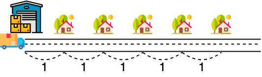
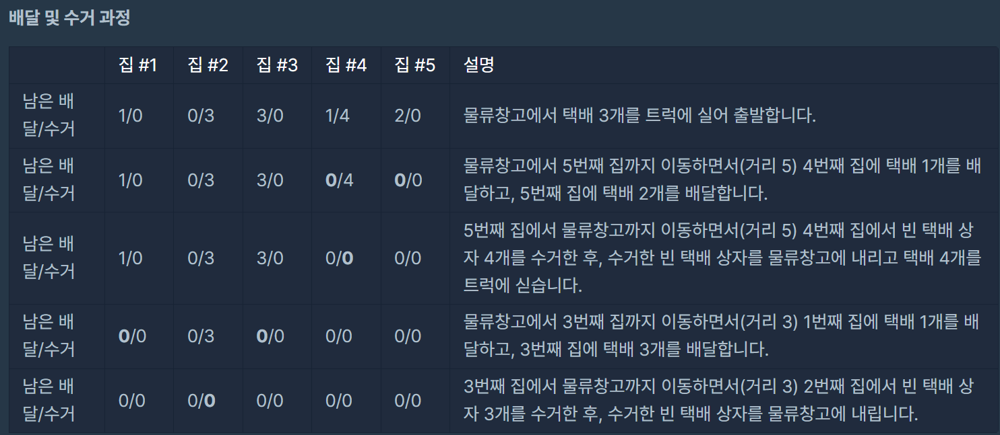

## 문제 링크
https://school.programmers.co.kr/learn/courses/30/lessons/150369

## 문제 설명


## 접근 과정

- n은 100,000 이기 떄문에 완탐으로는 안될거 같다고 생각하여 그리디 하게 생각하였습니다
- 문제 예제를 보면 아시다싶이 모든 예제들은 마지막 집부터 들립니다 왜냐하면 마지막 집부터 가는것이 효율적이기 때문입니다
- 그리하여 저 또한 마지막집부터 방문하였으며 해당 집들을 객체로 두어 문제를 풀이 하였습니다

## 시간 복잡도

O(N * M)

## 코드
```java
import java.util.ArrayList;
import java.util.Collections;
import java.util.List;
class Solution {
   public  long solution(int cap, int n, int[] deliveries, int[] pickups) {
        long distance = 0;
       List<House> houses = new ArrayList<>();

        for (int i = n ; i > 0 ; i--){
            House house = new House(i, pickups[i-1], deliveries[i-1]);
            houses.add(house);
        }
        
        int nowDelivery = 0;
        int nowPickup = 0;
        for (int i = 0; i < houses.size(); i++) {
            
            House curr = houses.get(i);
            
            int cnt = 0;
            
            if (curr.pickup == 0 && curr.delivery == 0) continue;
            while (nowPickup < curr.pickup || nowDelivery < curr.delivery) {
                    cnt++;
                    nowDelivery += cap; // 상자를 내려줌으로 차단
                    nowPickup += cap; // 상자를 듬으로 올려줌
                    }
                nowDelivery -= curr.delivery;
                nowPickup -= curr.pickup;
            distance += (long) curr.idx * cnt * 2;
        }
        return distance;
        }

    public static class House{
        int idx;
        int pickup;
        int delivery;


        @Override
        public String toString() {
            return "House{" +
                    "idx=" + idx +
                    ", pickup=" + pickup +
                    ", delivery=" + delivery +
                    '}';
        }

        public House(int idx, int pickup, int delivery) {
            this.idx = idx;
            this.pickup = pickup;
            this.delivery = delivery;
        }
    }
    /*
    가장 먼집 부터 배달 및 수거를 한다
     */
}
```
##  느낀점

- 로직을 생각하는 시간이 좀 오래걸렸습니다.
