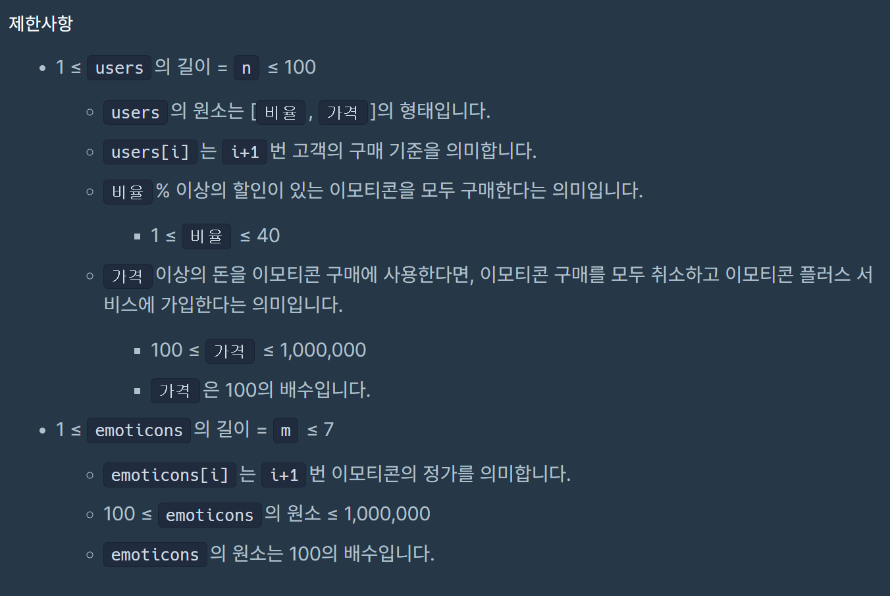

## 문제 링크
https://school.programmers.co.kr/learn/courses/30/lessons/150368?language=java

## 문제 설명

카카오톡에서는 이모티콘을 무제한으로 사용할 수 있는 이모티콘 플러스 서비스 가입자 수를 늘리려고 합니다.
이를 위해 카카오톡에서는 이모티콘 할인 행사를 하는데, 목표는 다음과 같습니다.

이모티콘 플러스 서비스 가입자를 최대한 늘리는 것.
이모티콘 판매액을 최대한 늘리는 것.

`1번 목표가 우선이며, 2번 목표가 그 다음입니다.`


## 접근 과정

- 제한사항을 보면 이모티콘은 최대 8개 할인율은 총 4 개가 존재하기 댸문에 4^8 * 100 * 8 = 52,428,800 이기때문에 완탐이 가능하다고 생각하였습니다
- 해당 할인율을 기반으로 할인율이 적용된 금액을 조합으로 생성하고 이모티콘의 수만큼 만들어진다면 계산하는 로직을 통해서 만들었습니다
## 시간 복잡도

O(4^M * N * M)

## 코드
```java
import java.util.ArrayList;
import java.util.Arrays;
import java.util.List;

class Solution {

    static double[] discounts = new double[] {0.4, 0.3, 0.2, 0.1};
    static int maxEmoji = Integer.MIN_VALUE;
    static int maxValue = Integer.MIN_VALUE;
    static boolean[] isVisited;
    
    public int[] solution(int[][] users, int[] emoticons) {
	    int r = emoticons.length;
	    isVisited = new boolean[emoticons.length];
	    comb(emoticons, r, 0, new ArrayList<>(), new int[emoticons.length], users);
	    return new int[] {maxEmoji, maxValue};
	}

	private static void comb(int[] emoticons, int r, int depth, List<Integer> list, int[] discount, int[][] users) {
		if (list.size() == r) {
			cal(list, discount, users);
			return;
		}
		for (int i = depth; i < r; i++) {
			for (int j = 0; j < discounts.length; j++) {
				if (!isVisited[i]) {
					isVisited[i] = true;
					int discountValue = (int)(emoticons[i] - (emoticons[i] * discounts[j]));
					discount[i] = (int)(discounts[j] * 100);
					list.add(discountValue);
					comb(emoticons, r, depth + 1, list, discount, users);
					isVisited[i] = false;
					list.remove(list.size() - 1);
				}
			}
		}
	}

	private static void cal(List<Integer> list, int[] discount, int[][] users) {
		int emoji = 0;
		int value = 0;
		for (int[] user : users) {
			int minDis = user[0];
			int maxPay = user[1];
			int sum = 0;
			for (int i = 0; i < discount.length; i++) {
				if (discount[i] >= minDis) {
					sum += list.get(i);
				}
			}
			if (maxPay <= sum) emoji++;
			else value += sum;
		}
		if (emoji > maxEmoji) {
			maxEmoji = emoji;
			maxValue = value;
		} else if (emoji == maxEmoji && value > maxValue) {
			maxValue = value;
		}
	}
}


```
