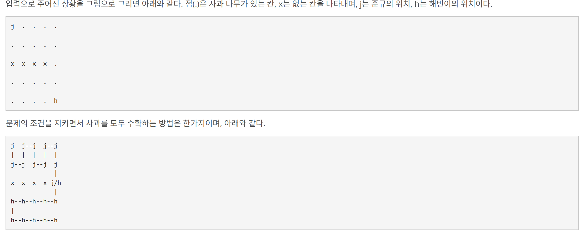

## 문제 링크
https://www.acmicpc.net/problem/5913

## 문제 설명

대학교를 졸업한 준규는 농부의 꿈을 이루기 위해서 가로 5m, 세로 5m 크기의 땅을 구입했다. 준규는 땅을 가로 1m, 세로 1m 크기로 구역을 나누었다. 가장 왼쪽 위 칸은 (1,1)이고 가장 오른쪽 아래 칸은 (5,5)이다. 준규의 땅을 아래 그림과 같이 나타낼 수 있다.

(1,1) (1,2) (1,3) (1,4) (1,5)
(2,1) (2,2) (2,3) (2,4) (2,5)
(3,1) (3,2) (3,3) (3,4) (3,5)
(4,1) (4,2) (4,3) (4,4) (4,5)
(5,1) (5,2) (5,3) (5,4) (5,5)
구역 K개를 제외한 각각의 구역에는 사과 나무가 하나씩 심어져 있다. K개 구역에는 거대한 돌이 있기 때문에 사과 나무가 심어져 있지 않다.

사과를 수확하는 일은 매우 귀찮은 일이다. 따라서, 준규는 친구 해빈이와 함께 재밌는 방법으로 수확을 하려고 한다.

준규는 (1,1)에서 사과를 수확하기 시작하고, 해빈이는 (5,5)에서 시작한다. (1,1)과 (5,5)에는 항상 사과 나무가 심어져 있다.





## 접근 과정

- 문제를 보고 dfs 를 활용하여 해결하면 된다고 생각하였습니다
- 준규와 해빈이의 위치는 1,1 , 5,5 로 고정되어있기 때문에 1,1 에서 5,5 로 가는 경우의 수가 몇가지 인지 구하면 되는 문제입니다

## 시간 복잡도

O(V+E)

## 코드
```java
package beakjoon;

import java.io.BufferedReader;
import java.io.IOException;
import java.io.InputStreamReader;
import java.util.StringTokenizer;

public class Boj5913 {
	static int[][] arr;
	static int[] dx = new int[] {1, 0, 0, -1};
	static int[] dy = new int[] {0, 1, -1, 0};

	static int target = 25;
	static int result = 0;
	static boolean[][] isVisited = new boolean[5][5];

	public static void main(String[] args) throws IOException {
		BufferedReader br = new BufferedReader(new InputStreamReader(System.in));
		StringTokenizer st = new StringTokenizer(br.readLine());

		int N = Integer.parseInt(st.nextToken()); // 가로막을 벽의 갯수
		arr = new int[5][5];
		for (int i = 0; i < N; i++) {
			st = new StringTokenizer(br.readLine());
			int row = Integer.parseInt(st.nextToken()) - 1;
			int col = Integer.parseInt(st.nextToken()) - 1;
			arr[row][col] = -1;
		}
		target = target - N;
		dfs(0, 0, 1);
		System.out.println(result);
	}

	private static void dfs(int jx, int jy, int cnt) {
		isVisited[jx][jy] = true;
		if (cnt == target && jx == 4 && jy == 4) {
			result++;
			return;
		}
		for (int d = 0; d < 4; d++) {
			int nextJx = jx + dx[d];
			int nextJy = jy + dy[d];
			if (isValid(nextJx, nextJy)) {
				if (!isVisited[nextJx][nextJy]) {
					isVisited[nextJx][nextJy] = true;
					dfs(nextJx, nextJy, cnt + 1);
					isVisited[nextJx][nextJy] = false;
				}
			}
		}
	}

	private static boolean isValid(int x, int y) {
		if (x < 0 || x >= 5 || y < 0 || y >= 5 || arr[x][y] == -1) return false;
		return true;
	}
}


```
