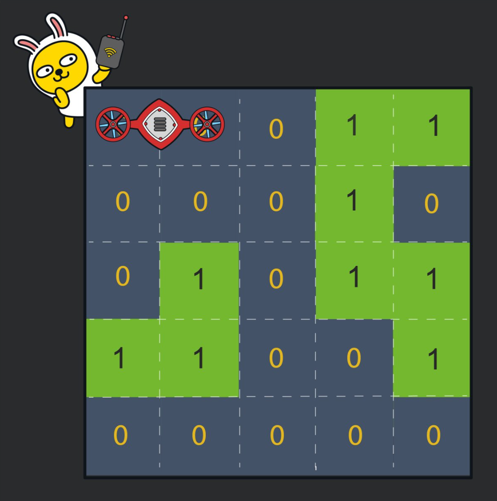
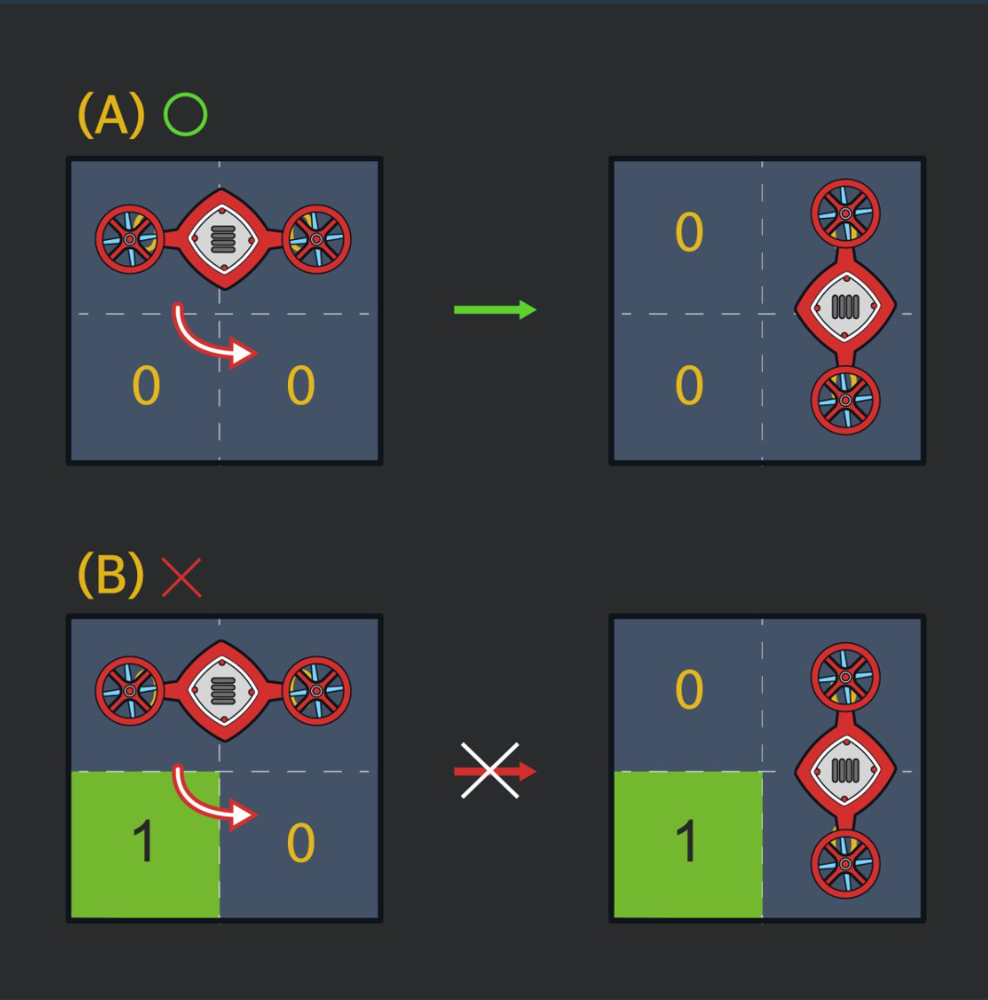

## 문제 링크
* https://school.programmers.co.kr/learn/courses/30/lessons/60063

## 문제 설명



위 사진에 존재하는 드론을 N,N 까지 최소로 이동하는 문제입니다.


## 시간복잡도


## 풀이

- 해당 문제를 보자마자 BFS를 응용하는 문제인것으로 확인하여 기본적인 BFS 로직을 구현한뒤 제약사항들을 기반으로 해당 문제를 풀었습니다.

- 위 사진을 보면 로봇은 회전을 할 수 있습니다 시계방향과 반시계방향으로 회전이 가능하지만 회전을 할 때 해당 회전할려고하는 방향에 벽 혹은 보드판을 넘게 될 경우 회전이 불가능해집니다
  - 여기서 또 문제가 중심축이 오른쪽 혹은 왼쪽을 기반으로 가능하다는 것입니다 그리하여 해당 로직을 판별히는게 이 문제의 주된 문제인것같습니다.
- 그리하여 기본적으로 BFS를 한번 돌리고 해당 위치에서 회전이 가능한지 여부를 확인하여 문제를 풀었습니다
- 마지막 isTarget 메서드를 통해서 N-1 위치에 도달하였을 경우 정답을 return 해주었습니다.

## 코드
```java
	static boolean[][][][] isVisited;
	static int[] dx = new int[] {1, 0, 0, -1};
	static int[] dy = new int[] {0, 1, -1, 0};
	static int N;
	static int[][] arr;
	
	public static int solution(int[][] board) {
		N = board.length;
		arr = board;
		isVisited = new boolean[N][N][N][N];
		return bfs();
	}

	private static int bfs() {
		Queue<Robot> q = new LinkedList<>();
		q.offer(new Robot(0, 0, 0, 1, 0));
		isVisited[0][0][0][1] = true;

		while (!q.isEmpty()) {
			Robot curr = q.poll();

			if (isTarget(curr)) return curr.dist;

			for (int d = 0; d < 4; d++) {
				int nx1 = curr.x1 + dx[d];
				int ny1 = curr.y1 + dy[d];
				int nx2 = curr.x2 + dx[d];
				int ny2 = curr.y2 + dy[d];

				if (isValid(nx1, ny1) && isValid(nx2, ny2) && !isVisited[nx1][ny1][nx2][ny2]) {
					isVisited[nx1][ny1][nx2][ny2] = true;
					q.offer(new Robot(nx1, ny1, nx2, ny2, curr.dist + 1));
				}
			}

			rotate(curr, q);
		}

		return -1;
	}

	private static void rotate(Robot robot, Queue<Robot> q) {
		if (robot.x1 == robot.x2) {
			for (int d : new int[] {1, -1}) {
				if (isValid(robot.x1 + d, robot.y1) && isValid(robot.x2 + d, robot.y2)) {
					if (!isVisited[robot.x1][robot.y1][robot.x1 + d][robot.y1]) {
						q.offer(new Robot(robot.x1, robot.y1, robot.x1 + d, robot.y1, robot.dist + 1));
						isVisited[robot.x1][robot.y1][robot.x1 + d][robot.y1] = true;
					}
					if (!isVisited[robot.x2][robot.y2][robot.x2 + d][robot.y2]) {
						q.offer(new Robot(robot.x2, robot.y2, robot.x2 + d, robot.y2, robot.dist + 1));
						isVisited[robot.x2][robot.y2][robot.x2 + d][robot.y2] = true;
					}
				}
			}
		}
		if (robot.y1 == robot.y2) {
			for (int d : new int[] {1, -1}) {
				if (isValid(robot.x1, robot.y1 + d) && isValid(robot.x2, robot.y2 + d)) {
					if (!isVisited[robot.x1][robot.y1][robot.x1][robot.y1 + d]) {
						q.offer(new Robot(robot.x1, robot.y1, robot.x1, robot.y1 + d, robot.dist + 1));
						isVisited[robot.x1][robot.y1][robot.x1][robot.y1 + d] = true;
					}
					if (!isVisited[robot.x2][robot.y2][robot.x2][robot.y2 + d]) {
						q.offer(new Robot(robot.x2, robot.y2, robot.x2, robot.y2 + d, robot.dist + 1));
						isVisited[robot.x2][robot.y2][robot.x2][robot.y2 + d] = true;
					}
				}
			}
		}
	}

	private static boolean isTarget(Robot curr) {
		return (curr.x1 == N - 1 && curr.y1 == N - 1) || (curr.x2 == N - 1 && curr.y2 == N - 1);
	}

	private static boolean isValid(int x, int y) {
		return x >= 0 && y >= 0 && x < N && y < N && arr[x][y] == 0;
	}

	private static class Robot {
		int x1, y1, x2, y2, dist;

		public Robot(int x1, int y1, int x2, int y2, int dist) {
			this.x1 = x1;
			this.y1 = y1;
			this.x2 = x2;
			this.y2 = y2;
			this.dist = dist;
		}
	}
}

```

## 느낀점
- 처음에는 해당 Visited 배열을 3차원으로 하여 [row][col][forward] 이렇게 좌표와 방향을 통해서 풀려고 하였습니다
- 하지만 N은 최대 100이기 떄문에 4차원배열 100^4의 공간을 사용하기 때문에 4차원배열을 통해서 직관적이고 쉽게 구현할 수 있다고 생각하였습니다.
- 확실히 카카오코테는 어렵다는걸 다시 느꼇습니다.