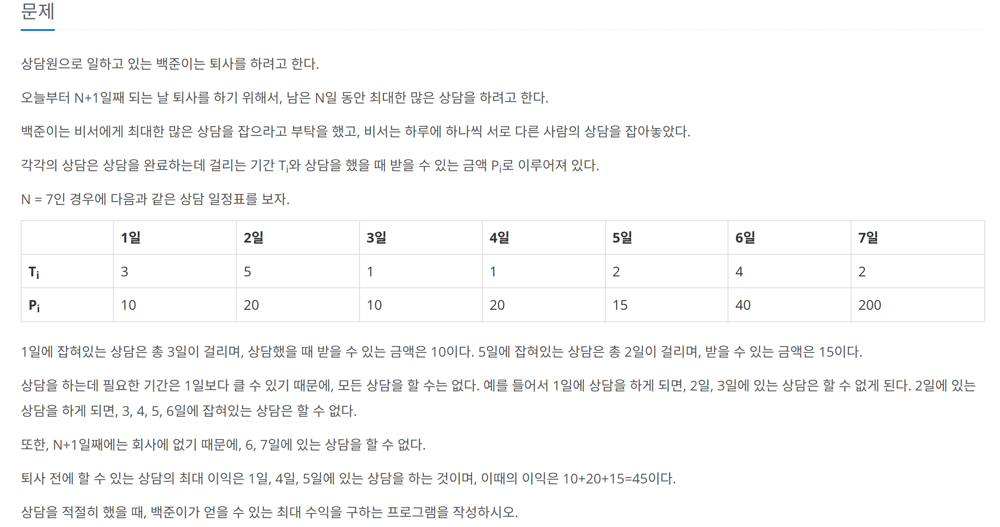

## 문제 링크
* https://www.acmicpc.net/problem/2600

## 문제 설명



## 시간복잡도

O(N)

## 풀이

N의 크기를 보면 알다싶이 완탐으로는 불가능하기떄문에 그리디 혹은 DP이기에 DP로 풀었습니다.

## 코드
```java
import java.io.BufferedReader;
import java.io.IOException;
import java.io.InputStreamReader;
import java.util.StringTokenizer;

public class Main {
	public static void main(String[] args) throws IOException {
		BufferedReader br = new BufferedReader(new InputStreamReader(System.in));
		StringTokenizer st = new StringTokenizer(br.readLine());

		int N = Integer.parseInt(st.nextToken());
		int[] days = new int[N + 1];
		int[] pays = new int[N + 1];
		for (int i = 1; i <= N; i++) {
			st = new StringTokenizer(br.readLine());
			days[i] = Integer.parseInt(st.nextToken());
			pays[i] = Integer.parseInt(st.nextToken());
		}
		days[0] = 0;
		pays[0] = 0;
		int[] dp = new int[N + 2];
		for (int i = 1; i <= N; i++) {
			dp[i + 1] = Math.max(dp[i + 1], dp[i]);
			if (days[i] + i <= N + 1) {
				dp[i + days[i]] = Math.max(dp[i + days[i]], pays[i] + dp[i]);
			}
		}
		System.out.println(dp[N+1]);
	}
}

```
## 느낀점
