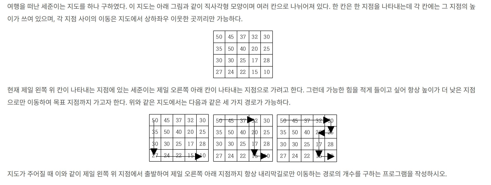

## 문제 링크
* https://www.acmicpc.net/problem/1520

## 문제 설명


## 시간복잡도

O(N*M)

## 풀이

- 찬의님이 저번에 푸신 보행자 천국이 생각이 나서 해당 방법을 활용하여 탑다운 방식으로 풀었습니다
- 문제를 잘못 이해해서 `그런데 가능한 힘을 적게 들이고 싶어 항상 높이가 더 낮은 지점으로만 이동하여 목표 지점까지 가고자 한다` 이 구문에서 해당 (인덱스의 존재하는 값 + 방향은 좌,우,하) 이렇게 제약조건을 생각해서 푸는시간이 엄청 오래 걸렸습니다.  

## 코드
```java
package beakjoon;

import java.io.BufferedReader;
import java.io.IOException;
import java.io.InputStreamReader;
import java.util.Arrays;
import java.util.StringTokenizer;

public class Boj1520 {
	static int[] dx = new int[] {1, 0, 0, -1};
	static int[] dy = new int[] {0, -1, 1, 0};
	static int[][] dp;
	static int N, M;
	static int[][] arr;

	public static void main(String[] args) throws IOException {
		BufferedReader br = new BufferedReader(new InputStreamReader(System.in));
		StringTokenizer st = new StringTokenizer(br.readLine());
		N = Integer.parseInt(st.nextToken());
		M = Integer.parseInt(st.nextToken());
		arr = new int[N][M];
		dp = new int[N][M];
		for (int i = 0; i < N; i++) {
			arr[i] = Arrays.stream(br.readLine().split(" ")).mapToInt(Integer::parseInt).toArray();
			Arrays.fill(dp[i], -1);
		}
		int result = start(0, 0);
		System.out.println(result);
	}

	private static int start(int x, int y) {
		if (x == N - 1 && y == M - 1) {
			return 1;
		}
		if (dp[x][y] != -1) {
			return dp[x][y];
		}
		dp[x][y] = 0;
		for (int d = 0; d < 4; d++) {
			int nx = dx[d] + x;
			int ny = dy[d] + y;
			if (nx >= 0 && ny >= 0 && nx < N && ny < M && arr[nx][ny] < arr[x][y]) {
				dp[x][y] += start(nx, ny);
			}
		}
		return dp[x][y];
	}
}


```
## 느낀점
- 확실히 많이 풀어봐야지 감이 잡힐것같습니다.
