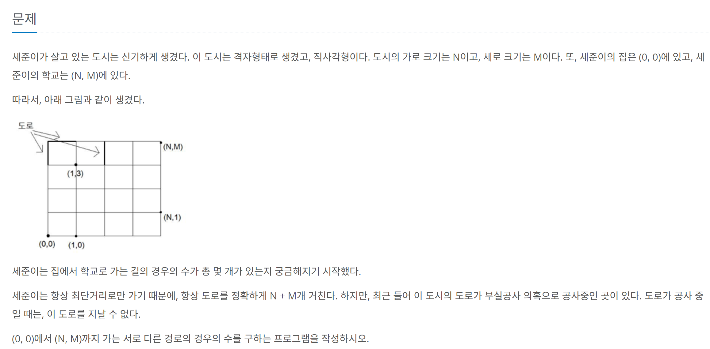

## 문제 링크
* https://www.acmicpc.net/problem/1577

## 문제 설명


## 시간복잡도

## 풀이

## 코드
```java
package beakjoon;

import java.io.BufferedReader;
import java.io.IOException;
import java.io.InputStreamReader;
import java.util.Arrays;
import java.util.StringTokenizer;

public class Boj1577 {
	static long[][] dp;
	static int[] dx = new int[] {0, 1};
	static int[] dy = new int[] {1, 0};
	static int N, M;
	static boolean[][][] block;

	public static void main(String[] args) throws IOException {
		BufferedReader br = new BufferedReader(new InputStreamReader(System.in));
		StringTokenizer st = new StringTokenizer(br.readLine());
		N = Integer.parseInt(st.nextToken());
		M = Integer.parseInt(st.nextToken());
		block = new boolean[N + 1][M + 1][2];  // [x][y][방향]
		dp = new long[N + 1][M + 1];
		for (int i = 0; i <= N; i++) {
			Arrays.fill(dp[i], -1);
		}
		int K = Integer.parseInt(br.readLine());
		for (int i = 0; i < K; i++) {
			st = new StringTokenizer(br.readLine());
			int x1 = Integer.parseInt(st.nextToken());
			int y1 = Integer.parseInt(st.nextToken());
			int x2 = Integer.parseInt(st.nextToken());
			int y2 = Integer.parseInt(st.nextToken());

			if (x1 == x2) {
				int minY = Math.min(y1, y2);
				block[x1][minY][0] = true;
			} else {
				int minX = Math.min(x1, x2);
				block[minX][y1][1] = true;
			}
		}

		long result = run(0, 0);
		System.out.println(result);
	}

	private static long run(int x, int y) {
		if (x == N && y == M)
			return 1;
		if (dp[x][y] != -1)
			return dp[x][y];
		dp[x][y] = 0;
		for (int d = 0; d < 2; d++) {
			int nx = dx[d] + x;
			int ny = dy[d] + y;
			if (nx > N || ny > M) continue;
			if (block[x][y][d]) continue;
			dp[x][y] += run(nx, ny);
		}
		return dp[x][y];
	}
}


```
## 느낀점
