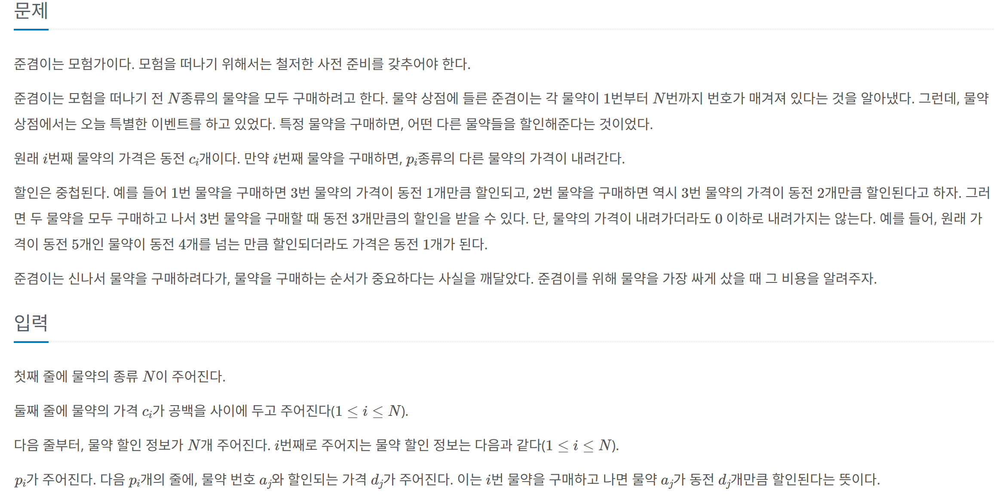

## 문제 링크
* https://www.acmicpc.net/problem/24954

## 문제 설명


## 시간복잡도

O(N^N-1)

## 풀이

백트래킹을 활용하여 풀었습니다.

## 코드
```java
import java.io.BufferedReader;
import java.io.IOException;
import java.io.InputStreamReader;
import java.util.ArrayList;
import java.util.Arrays;
import java.util.List;

public class Main{
	static boolean[] isVisited;
	static List<List<Potion>> potionsList;
	static int[] potions;
	static int minValue = Integer.MAX_VALUE;

	public static void main(String[] args) throws IOException {
		BufferedReader br = new BufferedReader(new InputStreamReader(System.in));
		int N = Integer.parseInt(br.readLine());
		potions = Arrays.stream(br.readLine().split(" ")).mapToInt(Integer::parseInt).toArray();
		isVisited = new boolean[N];
		potionsList = new ArrayList<>();

		for (int i = 0; i < N; i++) {
			potionsList.add(new ArrayList<>());
		}
		for (int i = 0; i < N; i++) {
			int C = Integer.parseInt(br.readLine());
			for (int c = 0; c < C; c++) {
				int[] discounts = Arrays.stream(br.readLine().split(" ")).mapToInt(Integer::parseInt).toArray();
				int index = discounts[0] - 1;
				int discountValue = discounts[1];
				potionsList.get(i).add(new Potion(index, discountValue));
			}
		}
		dfs(potions.clone(), new ArrayList<>());
		System.out.println(minValue);
	}

	private static void dfs(int[] clonePotion, List<Integer> list) {
		if (list.size() == clonePotion.length) {
			int sum = list.stream().mapToInt(Integer::valueOf).sum();
			minValue = Math.min(sum, minValue);
			return;
		}
		for (int i = 0; i < clonePotion.length; i++) {
			if (!isVisited[i]) {
				isVisited[i] = true;
				list.add(clonePotion[i]);
				int[] clone = clonePotion.clone();
				discount(clonePotion, i);
				dfs(clonePotion, list);
				clonePotion = clone;
				isVisited[i] = false;
				list.remove(list.size() - 1);
			}
		}
	}

	private static void discount(int[] clonePotion, int i) {
		for (int j = 0; j < potionsList.get(i).size(); j++) {
			Potion potion = potionsList.get(i).get(j);
			if (!isVisited[potion.index]) {
				clonePotion[potion.index] = Math.max(1, clonePotion[potion.index] - potion.value);
			}
		}
	}

	private static class Potion {
		int index;
		int value;

		public Potion(int index, int value) {
			this.index = index;
			this.value = value;
		}
	}
}


```
## 느낀점
- 솔직히 실버 1이라서 너무 쉽게 생각을 했는데 거의 한시간동안 풀었던거 같습니다
