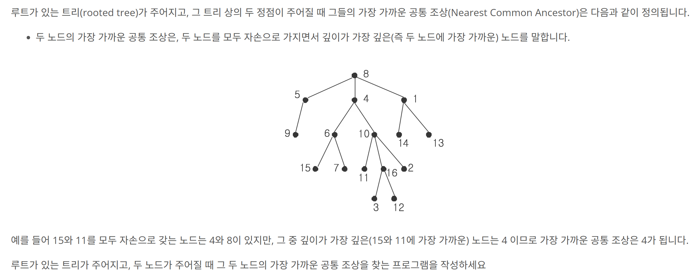

## 문제 링크
* https://www.acmicpc.net/problem/3584

## 문제 설명

## 시간복잡도

O(V+E)

## 풀이
- LCA(Lowest Common Ancestor) 알고리즘을 기반으로 문제를 풀었습니다
- LCA 에서는 배열을 사용하는데 Parent 와 Depth 를 사용합니다
  - Parent 배열은 해당 노드의 Parent 가 누구인지를 담는 배열입니다.
  - Depth 는 해당 노드의 깊이가 몇인지를 확인하는 배열입니다
- 해당 두개의 배열을 활용하여 DFS 를 실행하여 사전값들을 넣어주고 lca라는 메서드를 통해서 문제를 풀었습니다.

## 코드
```java
import java.io.BufferedReader;
import java.io.BufferedWriter;
import java.io.IOException;
import java.io.InputStreamReader;
import java.io.OutputStreamWriter;
import java.util.ArrayList;
import java.util.List;
import java.util.StringTokenizer;

public class Main {
	static List<List<Integer>> graph;
	static boolean[] isVisited;
	static int N;
	static int[] parents;
	static int[] depth;
	static BufferedWriter bw = new BufferedWriter(new OutputStreamWriter(System.out));

	public static void main(String[] args) throws IOException {
		BufferedReader br = new BufferedReader(new InputStreamReader(System.in));
		int T = Integer.parseInt(br.readLine());
		for (int t = 0; t < T; t++) {
			StringTokenizer st = new StringTokenizer(br.readLine());
			N = Integer.parseInt(st.nextToken());
			graph = new ArrayList<>();
			depth = new int[N + 1];
			parents = new int[N + 1];
			isVisited = new boolean[N + 1];
			boolean[] isChild = new boolean[N + 1];

			for (int i = 0; i <= N; i++) {
				graph.add(new ArrayList<>());
			}
			for (int i = 0; i < N - 1; i++) {
				st = new StringTokenizer(br.readLine());
				int parent = Integer.parseInt(st.nextToken());
				int child = Integer.parseInt(st.nextToken());
				graph.get(parent).add(child);
				graph.get(child).add(parent);
				isChild[child] = true;

			}
			int root = 0;
			for (int i = 1; i <= N; i++) {
				if (!isChild[i]) {
					root = i;
					break;
				}
			}
			dfs(root, 0);
			st = new StringTokenizer(br.readLine());
			int a = Integer.parseInt(st.nextToken());
			int b = Integer.parseInt(st.nextToken());
			lca(a, b);
		}
		bw.flush();
		bw.close();
	}

	private static void lca(int a, int b) throws IOException {
		while (depth[a] > depth[b]) {
			a = parents[a];
		}
		while (depth[b] > depth[a]) {
			b = parents[b];
		}
		while (a != b) {
			a = parents[a];
			b = parents[b];
		}
		bw.write(String.valueOf(a));
		bw.newLine();
	}

	private static void dfs(int node, int parent) {
		isVisited[node] = true;
		parents[node] = parent;
		depth[node] = depth[parent] + 1;
		for (int child : graph.get(node)) {
			if (!isVisited[child]) {
				dfs(child, node);
			}
		}
	}
}

```
## 느낀점

- 해당 문제와같은 유형을 처음풀어보아서 인접리스틑를 통해 그래프를 구하고 DFS 를 통해서 공통조상을 찾을려고 했지만 어떻게 해당 로직을 구현해야할지 고민을하다 문제의 해설을 기반하여 풀었습니다.
- 확실히 트리와 같은 문제는 생소하여서 좀 더 많이 공부를 해보아야지 문제를 수월하게 풀 수 있을거 같다는 느낌을 받았습니다.

