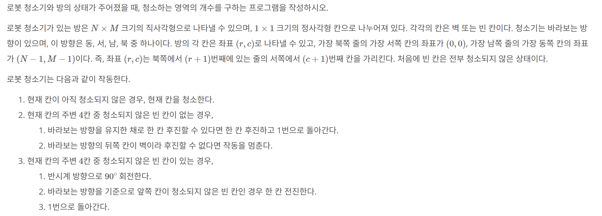

## 문제 링크
* https://www.acmicpc.net/problem/2252

## 문제 설명

## 시간복잡도

O(N * M * 4)


## 풀이
- 문제에서 제시된 조건문을 토대로 구현을 하였습니다.
## 코드
```java
import java.io.BufferedReader;
import java.io.IOException;
import java.io.InputStreamReader;
import java.util.ArrayDeque;
import java.util.Arrays;
import java.util.Queue;
import java.util.StringTokenizer;

public class Main {
	static int N, M;
	static int[][] arr;

	static int[] dx = new int[] {1, 0, 0, -1};
	static int[] dy = new int[] {0, -1, 1, 0};

	// 전진시에는 1, 후진시에는 0
	static int[][][] robotDx = new int[][][] {
		{
			{1}, {0}, {-1}, {0}
		}, // [후진][방향]
		{
			{-1}, {0}, {1}, {0},
		}
	}; // 북{전진 -1, 후진 1}, 동[0,0] , 남{전진 1,후진-1} ,서[0,0]
	static int[][][] robotDy = new int[][][] {
		{
			{0}, {-1}, {0}, {1}
		}, // [전진][방향]
		{
			{0}, {1}, {0}, {-1},
		}
	}; // 동{전진 1, 후진 -1},  서{전진 -1, 후진 1}

	// 0 북쪽 1 동쪽 2 남쪽 3 서쪽
	public static void main(String[] args) throws IOException {
		BufferedReader br = new BufferedReader(new InputStreamReader(System.in));
		StringTokenizer st = new StringTokenizer(br.readLine());

		N = Integer.parseInt(st.nextToken());
		M = Integer.parseInt(st.nextToken());

		arr = new int[N][M];
		int[] curr = Arrays.stream(br.readLine().split(" ")).mapToInt(Integer::valueOf).toArray();
		Robot robot = new Robot(curr[0], curr[1], curr[2], 1);
		for (int i = 0; i < N; i++) {
			arr[i] = Arrays.stream(br.readLine().split(" ")).mapToInt(Integer::valueOf).toArray();
		}
		int result = clean(robot);
		System.out.println(result);
	}

	private static int clean(Robot robot) {
		Queue<Robot> q = new ArrayDeque<>();
		q.offer(robot);
		while (!q.isEmpty()) {
			Robot curr = q.poll();
			arr[curr.x][curr.y] = 2; // 현재칸을 청소
			boolean isDirty = false; // 더러운지에 대한 플래그
			for (int d = 0; d < 4; d++) {
				int nextX = dx[d] + curr.x;
				int nextY = dy[d] + curr.y;
				if (nextX < 0 || nextX >= N || nextY < 0 || nextY >= M) continue;
				if (arr[nextX][nextY] == 0) {
					isDirty = true;
					break;
				}
			}
			if (isDirty) { // 반시계로 돌리면서 전진
				int nextForward = curr.forward;
				for (int d = 0; d < 4; d++) {
					if (nextForward - 1 < 0) {
						nextForward = 3;
					} else {
						nextForward -= 1;
					}
					int nextRobotX = curr.x + robotDx[1][nextForward][0];
					int nextRobotY = curr.y + robotDy[1][nextForward][0];
					if (arr[nextRobotX][nextRobotY] == 0) {
						q.offer(new Robot(nextRobotX, nextRobotY, nextForward, curr.dist + 1));
						break;
					}
				}
			} else { // 후진
				int nextRobotX = curr.x + robotDx[0][curr.forward][0];
				int nextRobotY = curr.y + robotDy[0][curr.forward][0];
				if (nextRobotX < 0 || nextRobotY < 0 || nextRobotX >= N || nextRobotY >= M
					|| arr[nextRobotX][nextRobotY] == 1) return curr.dist;
				Robot nextRobot = new Robot(nextRobotX, nextRobotY, curr.forward, curr.dist);
				q.offer(nextRobot);
			}
		}
		return 0;
	}

	private static class Robot {
		int x;
		int y;
		int forward; //0 북, 1, 동, 2,남, 3서
		int dist;

		public Robot(int x, int y, int forward, int dist) {
			this.x = x;
			this.y = y;
			this.forward = forward;
			this.dist = dist;
		}

	}
}


```
## 느낀점
- 확실히 구현문제라서 그런지 푸는데 1시간 걸린거같습니다.
- 삽질목록
  - 문제를 잘못읽어 로봇이 청소한 칸의 횟수가 아닌 , 움직인 횟수인줄알고 여기서 삽질을 하였습니다
  - 0이 청소가 안되어있는칸 1은 벽인데 잘못 이해해서 청소를 안해도 되는칸인줄알고 벽처리를 안해서 여기서 또 삽질을 하였습니다.
- 문제를 꼼꼼히 확인해야한다는걸 다시 느꼇습니다.
