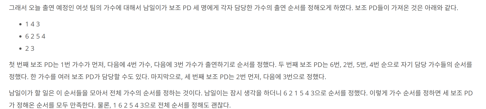

## 문제 링크
* https://www.acmicpc.net/problem/2252

## 문제 설명

## 시간복잡도

메인로직은 O(V+E)


## 풀이
- 음악 프로그램과 유사하여 변형하여 풀었습니다.

## 코드
```java
import java.io.BufferedReader;
import java.io.IOException;
import java.io.InputStreamReader;
import java.util.ArrayDeque;
import java.util.ArrayList;
import java.util.List;
import java.util.Map;
import java.util.Queue;
import java.util.StringTokenizer;
import java.util.TreeMap;

public class Boj2252 {
	public static void main(String[] args) throws IOException {
		BufferedReader br = new BufferedReader(new InputStreamReader(System.in));
		StringTokenizer st = new StringTokenizer(br.readLine());
		Map<Integer, Integer> map = new TreeMap<>();
		int N = Integer.parseInt(st.nextToken());
		int M = Integer.parseInt(st.nextToken());
		List<List<Integer>> graph = new ArrayList<>();
		for (int i = 0; i <= N; i++)
			graph.add(new ArrayList<>());
		for (int i = 0; i < M; i++) {
			st = new StringTokenizer(br.readLine());
			int from = Integer.parseInt(st.nextToken());
			int to = Integer.parseInt(st.nextToken());
			graph.get(from).add(to);
			map.put(to, map.getOrDefault(to, 0) + 1);
		}
		Queue<Integer> q = new ArrayDeque<>();
		for (int i = 1; i <= N; i++) {
			if (!map.containsKey(i)) {
				q.offer(i);
			}
		}
		StringBuilder sb = new StringBuilder();
		while (!q.isEmpty()) {
			Integer curr = q.poll();
			sb.append(curr).append(" ");
			for (int next : graph.get(curr)) {
				if (map.containsKey(next)) {
					map.put(next, map.getOrDefault(next, 0) - 1);
				}
				if (map.get(next) < 1) {
					q.offer(next);
				}
			}
		}
		System.out.println(sb.toString());
	}
}

```
## 느낀점

