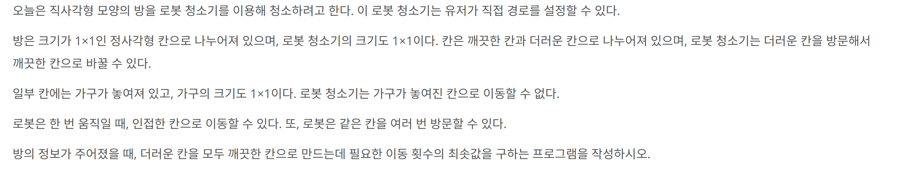

## 문제 링크
* https://www.acmicpc.net/problem/4991

## 문제 설명

## 시간복잡도

O(k^2 * NM)+O(k * k!)
## 풀이

- 문제를 처음보고 `더러운 칸은 최대 10개 까지만 존재한다`를 보고 완전탐색을 해야한다고 생각을 하였습니다
- 그리하여 bfs를 활용해서 문제를 풀었지만 시간복잡도를 초과하여 다시 작성하였습니다
- 풀다가 시간이 너무 지체되어서 정답을 보고 해당 정답을 기반으로 다시 코드를 작성하여 문제를 풀었습니다

## 코드

```java
import java.io.BufferedReader;
import java.io.IOException;
import java.io.InputStreamReader;
import java.util.ArrayList;
import java.util.HashSet;
import java.util.LinkedList;
import java.util.List;
import java.util.Objects;
import java.util.Queue;
import java.util.Set;
import java.util.StringTokenizer;

public class Main {
	static int[] dx = {-1, 1, 0, 0};
	static int[] dy = {0, 0, -1, 1};
	static int N, M;
	static char[][] arr;
	static List<Point> points;

	public static void main(String[] args) throws IOException {
		BufferedReader br = new BufferedReader(new InputStreamReader(System.in));

		while (true) {
			StringTokenizer st = new StringTokenizer(br.readLine());
			M = Integer.parseInt(st.nextToken());
			N = Integer.parseInt(st.nextToken());

			if (M == 0 && N == 0) break;

			arr = new char[N][M];
			points = new ArrayList<>();
			Point start = null;

			for (int i = 0; i < N; i++) {
				String line = br.readLine();
				for (int j = 0; j < M; j++) {
					arr[i][j] = line.charAt(j);
					if (arr[i][j] == 'o') {
						start = new Point(i, j);
					} else if (arr[i][j] == '*') {
						points.add(new Point(i, j));
					}
				}
			}

			System.out.println(bfs(start));
		}
	}

	static int bfs(Point start) {
		Queue<Node> q = new LinkedList<>();
		Set<Node> visited = new HashSet<>();

		Node node = new Node(start.x, start.y, 0, new HashSet<>());
		q.offer(node);
		visited.add(node);

		while (!q.isEmpty()) {
			Node curr = q.poll();
			if (curr.visited.size() == points.size()) {
				return curr.dist;
			}
			for (int i = 0; i < 4; i++) {
				int nx = curr.x + dx[i];
				int ny = curr.y + dy[i];
				if (nx < 0 || nx >= N || ny < 0 || ny >= M || arr[nx][ny] == 'x') continue;
				Set<Point> nextVisited = new HashSet<>(curr.visited);
				if (arr[nx][ny] == '*') {
					for (Point dirty : points) {
						if (dirty.x == nx && dirty.y == ny) {
							nextVisited.add(dirty);
							break;
						}
					}
				}
				Node nextNode = new Node(nx, ny, curr.dist + 1, nextVisited);
				if (visited.add(nextNode)) {
					q.offer(nextNode);
				}
			}
		}

		return -1;
	}

	static class Point {
		int x, y;

		public Point(int x, int y) {
			this.x = x;
			this.y = y;
		}

		@Override
		public boolean equals(Object o) {
			if (this == o) return true;
			if (o == null || getClass() != o.getClass()) return false;
			Point point = (Point)o;
			return x == point.x && y == point.y;
		}

		@Override
		public int hashCode() {
			return Objects.hash(x, y);
		}
	}

	static class Node {
		int x, y, dist;
		Set<Point> visited;

		public Node(int x, int y, int dist, Set<Point> visited) {
			this.x = x;
			this.y = y;
			this.dist = dist;
			this.visited = new HashSet<>(visited);
		}

		@Override
		public boolean equals(Object o) {
			if (this == o) return true;
			if (o == null || getClass() != o.getClass()) return false;
			Node node = (Node)o;
			return x == node.x && y == node.y && visited.equals(node.visited);
		}

		@Override
		public int hashCode() {
			return Objects.hash(x, y, visited);
		}
	}
}
```
```java
import java.io.BufferedReader;
import java.io.IOException;
import java.io.InputStreamReader;
import java.util.ArrayDeque;
import java.util.ArrayList;
import java.util.Arrays;
import java.util.List;
import java.util.Objects;
import java.util.Queue;
import java.util.StringTokenizer;

public class Main {
	static int[] dx = {-1, 1, 0, 0};
	static int[] dy = {0, 0, -1, 1};
	static int h, w;
	static char[][] map;
	static List<Point> dirties;
	static int[][] distances;
	static int answer;

	public static void main(String[] args) throws IOException {
		BufferedReader br = new BufferedReader(new InputStreamReader(System.in));

		while (true) {
			StringTokenizer st = new StringTokenizer(br.readLine());
			w = Integer.parseInt(st.nextToken());
			h = Integer.parseInt(st.nextToken());

			if (w == 0 && h == 0) break;

			map = new char[h][w];
			dirties = new ArrayList<>();
			Point start = null;

			for (int i = 0; i < h; i++) {
				String line = br.readLine();
				for (int j = 0; j < w; j++) {
					map[i][j] = line.charAt(j);
					if (map[i][j] == 'o') {
						start = new Point(i, j);
					} else if (map[i][j] == '*') {
						dirties.add(new Point(i, j));
					}
				}
			}
			dirties.add(start);
			distances = new int[dirties.size()][dirties.size()];

			if (!isCalculate()) {
				System.out.println(-1);
				continue;
			}

			answer = Integer.MAX_VALUE;
			boolean[] isVisited = new boolean[dirties.size()];
			dfs(dirties.size() - 1, 0, 0, isVisited);

			System.out.println(answer == Integer.MAX_VALUE ? -1 : answer);
		}
	}

	private static void dfs(int current, int count, int totalDist, boolean[] isVisited) {
		if (count == dirties.size() - 1) {
			answer = Math.min(totalDist, answer);
			return;
		}

		if (totalDist >= answer) return;
		for (int next = 0; next < dirties.size() - 1; next++) {
			if (!isVisited[next]) {
				isVisited[next] = true;
				dfs(next, count + 1, totalDist + distances[current][next], isVisited);
				isVisited[next] = false;
			}
		}
	}

	public static boolean isCalculate() {
		for (int i = 0; i < dirties.size(); i++) {
			for (int j = i + 1; j < dirties.size(); j++) {
				Point from = dirties.get(i);
				Point to = dirties.get(j);
				int dist = bfs(from, to);
				if (dist == -1) {
					return false;
				} else {
					distances[i][j] = distances[j][i] = dist;
				}
			}
		}
		return true;
	}

	private static int bfs(Point from, Point to) {
		Queue<Point> q = new ArrayDeque<>();
		int[][] dist = new int[h][w];
		q.offer(from);
		for (int[] dis : dist) {
			Arrays.fill(dis, -1);
		}
		dist[from.x][from.y] = 0;
		while (!q.isEmpty()) {
			Point curr = q.poll();
			if (curr.x == to.x && curr.y == to.y) {
				return dist[curr.x][curr.y];
			}
			for (int d = 0; d < 4; d++) {
				int nx = dx[d] + curr.x;
				int ny = dy[d] + curr.y;
				if (nx < 0 || ny < 0 || nx >= h || ny >= w || dist[nx][ny] != -1 || map[nx][ny] == 'x') continue;
				dist[nx][ny] = dist[curr.x][curr.y] + 1;
				q.offer(new Point(nx, ny));
			}
		}
		return -1;
	}

	static class Point {
		int x, y;

		public Point(int x, int y) {
			this.x = x;
			this.y = y;
		}
	}
}
```
## 느낀점
- bfs와 dfs를 두개 혼용하여 사용하여 문제가 어려운 감이 없지않아 있던거 같습니다
- 처음보는 유형이여서 코드를 이해하는데 시간이 좀 걸렸습니다. 