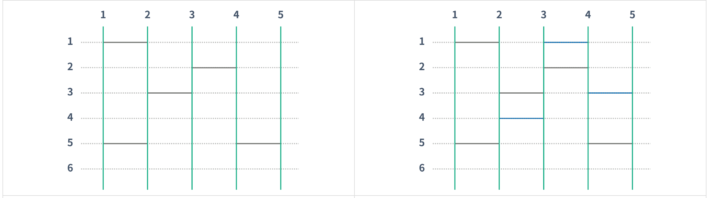

## 문제 링크
* https://www.acmicpc.net/problem/15684

## 문제 설명
기존의 존재하는 사다리 + 3개 이하의 임의 사다리를 활용하여 i번쨰로 시작하는 사다리가 i번째로 끝나게하는 문제입니다


## 시간복잡도


## 풀이

- 문제를 보자말자 백트래킹을 활용한 구현문제라는걸 파악하고 해당 조건들을 활용하여 문제를 풀기로 하였습니다.
- 

## 코드

```java
import java.io.BufferedReader;
import java.io.IOException;
import java.io.InputStreamReader;
import java.util.StringTokenizer;

public class Main {
	static int N, M, H;
	static int result = 4;
	static int[][] ladder;

	public static void main(String[] args) throws IOException {
		BufferedReader br = new BufferedReader(new InputStreamReader(System.in));
		StringTokenizer st = new StringTokenizer(br.readLine());

		N = Integer.parseInt(st.nextToken());
		M = Integer.parseInt(st.nextToken()); // 놓을 수 있는 사다리의 수
		H = Integer.parseInt(st.nextToken()); // 높이
		ladder = new int[H + 1][N + 1];
		for (int i = 0; i < M; i++) {
			st = new StringTokenizer(br.readLine());
			int col = Integer.parseInt(st.nextToken());
			int row = Integer.parseInt(st.nextToken());
			ladder[col][row] = 1;
		}
		for (int i = 0; i <= 3; i++) {
			dfs(i, 0, 1, 1);
			if (result <= i) {
				System.out.println(result);
				return;
			}
		}
		System.out.println(-1);
	}

	private static void dfs(int maxCnt, int cnt, int x, int y) {
		if (cnt == maxCnt) {
			if (check()) {
				result = Math.min(result, cnt);
			}
			return;
		}
		for (int i = x; i <= H; i++) {
			for (int j = (i == x ? y : 1); j < N; j++) {
				if (ladder[i][j - 1] == 0 && ladder[i][j] == 0 && ladder[i][j + 1] == 0) {
					ladder[i][j] = 1;
					dfs(maxCnt, cnt + 1, i, j + 2);
					ladder[i][j] = 0;
				}
			}
		}
	}

	private static boolean check() {
		for (int i = 1; i <= N; i++) {
			int col = i;
			int row = 1;
			while (row <= H) {
				if (ladder[row][col] == 1) {
					col++;
				} else if (col > 1 && ladder[row][col - 1] == 1) {
					col--;
				}
				row++;
			}
			if (col != i) return false;
		}
		return true;
	}
}
/*
[1, 0, 0, 0],
[0, 0, 1, 0],
[0, 1, 0, 0],
[0, 0, 0, 0],
[1, 0, 0, 1]
[0, 0, 0, 0]
자신의 인덱스 -1 == 왼쪽
자신의 인덱스에 존재할경우 == 오른쪽
dfs?

 */
```
## 느낀점
- 어떻게 하면 백트래킹을 활용할지에 대한 아이디어를 떠올리는데 시간이 많이 소모되었습니다.