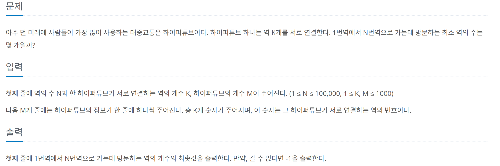

## 문제 링크
* https://www.acmicpc.net/problem/5214

## 문제 설명


## 시간복잡도

O((N+K)*M)

## 풀이
- 보고 생각한것은 그래프를 만들어서 해당 그래프 내부에서 BFS를 돌리면 된다고 생각하였습니다.
- 하지만 메모리 초과가 계속하여 발생하여서 문제를 다시 곰곰히 생각하여 해당 하이퍼스테이션의 존재하는 노드들을 다 연결하는것이 아닌 하이퍼스테이션 역의 역할을 하는 인덱스를 만들어야한다 라고 생각하여 다시 문제를 풀었습니다

## 코드
```java
// 메모리초과 다 연결한 코드
import java.io.BufferedReader;
import java.io.IOException;
import java.io.InputStreamReader;
import java.util.ArrayDeque;
import java.util.ArrayList;
import java.util.Arrays;
import java.util.HashSet;
import java.util.List;
import java.util.Queue;
import java.util.Set;
import java.util.StringTokenizer;

public class Main {
	static int result = Integer.MAX_VALUE;
	static int N, K, M;

	public static void main(String[] args) throws IOException {
		BufferedReader br = new BufferedReader(new InputStreamReader(System.in));
		StringTokenizer st = new StringTokenizer(br.readLine());
		N = Integer.parseInt(st.nextToken()); // 역의 개수
		K = Integer.parseInt(st.nextToken()); // 하이퍼 튜브가 연결된 역의 개수
		M = Integer.parseInt(st.nextToken()); // 하이퍼 튜브의 개수
		List<Set<Integer>> graph = new ArrayList<>();

		for (int i = 0; i <= N; i++)
			graph.add(new HashSet<>());

		for (int i = 0; i < M; i++) {
			int[] arr = Arrays.stream(br.readLine().split(" ")).mapToInt(Integer::valueOf).toArray();
			for (int k = 0; k < K; k++) {
				int from = arr[k];
				int to = arr[(k + 1) % K];
				if (from > to) {
					graph.get(to).add(from);
				} else {
					graph.get(from).add(to);
				}
			}
		}
		bfs(graph);
		System.out.println(result == Integer.MAX_VALUE ? -1 : result);
	}

	private static void bfs(List<Set<Integer>> graph) {
		boolean[][] isVisited = new boolean[N + 1][N + 1];
		Queue<Node> q = new ArrayDeque<>();
		q.offer(new Node(1, 1));
		while (!q.isEmpty()) {
			Node curr = q.poll();
			if (curr.curr == N) {
				result = curr.dist;
				return;
			}
			for (Integer next : graph.get(curr.curr)) {
				if (!isVisited[curr.curr][next]) {
					isVisited[curr.curr][next] = true;
					q.offer(new Node(next, curr.dist + 1));
				}
			}
		}
	}

	private static class Node {
		int curr;
		int dist;

		public Node(int curr, int dist) {
			this.curr = curr;
			this.dist = dist;
		}
	}
}
```
```java
import java.io.BufferedReader;
import java.io.IOException;
import java.io.InputStreamReader;
import java.util.*;
import java.util.ArrayList;
import java.util.LinkedList;
import java.util.List;
import java.util.Queue;
import java.util.StringTokenizer;

public class Main {
	static int result = Integer.MAX_VALUE;
	static int N, K, M;

	public static void main(String[] args) throws IOException {
		BufferedReader br = new BufferedReader(new InputStreamReader(System.in));
		StringTokenizer st = new StringTokenizer(br.readLine());
		N = Integer.parseInt(st.nextToken()); // 역의 개수
		K = Integer.parseInt(st.nextToken()); // 하이퍼 튜브가 연결된 역의 개수
		M = Integer.parseInt(st.nextToken()); // 하이퍼 튜브의 개수
		List<List<Integer>> graph = new ArrayList<>();

		for (int i = 0; i <= N + M; i++)
			graph.add(new LinkedList<>());

		for (int i = 1; i <= M; i++) {
			st = new StringTokenizer(br.readLine());
			for (int k = 0; k < K; k++) {
				int station = Integer.parseInt(st.nextToken());
				graph.get(station).add(i + N);
				graph.get(i + N).add(station);
			}
		}
		System.out.println(bfs(graph));
	}

	private static int bfs(List<List<Integer>> graph) {
	Queue<Node> q = new PriorityQueue<>(new Comparator<Node>() {
			@Override
			public int compare(Node o1, Node o2) {
				return o1.dist - o2.dist;
			}
		});		
		boolean[] visited = new boolean[N + M + 1];
		q.offer(new Node(1, 1));
		while (!q.isEmpty()) {
			Node curr = q.poll();
			if (curr.curr == N) {
				return curr.dist;
			}
			for (Integer next : graph.get(curr.curr)) {
				if (!visited[next]) {
					visited[next] = true;
					if (next > N) {
						q.offer(new Node(next, curr.dist));
					} else {
						q.offer(new Node(next, curr.dist + 1));
					}
				}
			}
		}
		return -1;
	}

	private static class Node {
		int curr;
		int dist;

		public Node(int curr, int dist) {
			this.curr = curr;
			this.dist = dist;
		}
	}
}


```
## 느낀점
- 문제만 보면 단순한 그래프를 통한 bfs인줄 알았지만 메모리 초과때문에 시간을 많이 잡아먹었습니다.