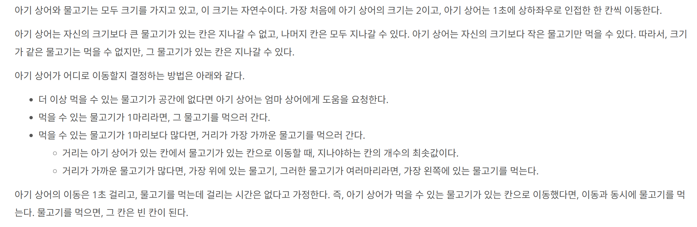

## 문제 링크
* https://www.acmicpc.net/problem/16236


## 시간복잡도

O(N^4 log N)

BFS(N^2) * PQ sorting sequence (N^2 log N)

## 풀이
- 항상 시뮬레이션 문제를 풀때면 해당 문제에서 주어진 조건을 기반으로 문제를 풀려고 노력을 합니다

위 사진과 같이 존재하는 제약조건과 순차를 따라서 코드를 작성하였습니다
- 하지만 저같은 경우에는 문제 예제 3번이 이해가 안되어서 거의 20분동안 문제를 보았던거 같습니다.


## 코드
```java
import java.io.BufferedReader;
import java.io.IOException;
import java.io.InputStreamReader;
import java.util.ArrayDeque;
import java.util.Comparator;
import java.util.PriorityQueue;
import java.util.Queue;
import java.util.StringTokenizer;

public class Main {
	static int[][] move = new int[][] {{-1, 0}, {0, -1}, {0, 1}, {1, 0}}; // 상, 좌, 우, 하
	static int currSize = 2;
	static int currFeed = 2;
	static int[][] arr;
	static int N;
	static int sharkX, sharkY;

	public static void main(String[] args) throws IOException {
		BufferedReader br = new BufferedReader(new InputStreamReader(System.in));
		StringTokenizer st = new StringTokenizer(br.readLine());
		N = Integer.parseInt(st.nextToken());
		arr = new int[N][N];
		for (int i = 0; i < N; i++) {
			String[] line = br.readLine().split(" ");
			for (int j = 0; j < N; j++) {
				int value = Integer.parseInt(line[j]);
				if (value == 9) {
					sharkX = i;
					sharkY = j;
				} else {
					arr[i][j] = value;
				}
			}
		}
		int result = 0;
		while (true) {
			if (isNotEnoughFeed()) {
				break;
			}
			int time = bfs();
			if (time == 0) break;
			result += time;
		}
		System.out.println(result);
	}

	private static boolean isNotEnoughFeed() {
		int temp = 0;
		for (int i = 0; i < arr.length; i++) {
			for (int j = 0; j < arr.length; j++) {
				if (arr[i][j] != 0 && arr[i][j] < currSize) {
					temp++;
				}
			}
		}
		return temp == 0;
	}

	private static int bfs() {
		boolean[][] visited = new boolean[N][N];
		Queue<int[]> q = new ArrayDeque<>();
		q.offer(new int[] {sharkX, sharkY, 0});
		visited[sharkX][sharkY] = true;
		Queue<Shark> pq = new PriorityQueue<>(new Comparator<Shark>() {
			@Override
			public int compare(Shark o1, Shark o2) {
				if (o1.dist == o2.dist) {
					if (o1.x == o2.x) {
						return o1.y - o2.y;
					} else {
						return o1.x - o2.x;
					}
				} else {
					return o1.dist - o2.dist;
				}
			}
		});
		while (!q.isEmpty()) {
			int[] curr = q.poll();
			for (int d = 0; d < 4; d++) {
				int nx = curr[0] + move[d][0];
				int ny = curr[1] + move[d][1];
				if (isValid(nx, ny) && !visited[nx][ny] && arr[nx][ny] <= currSize) {
					visited[nx][ny] = true;
					q.offer(new int[] {nx, ny, curr[2] + 1});
					if (arr[nx][ny] > 0 && arr[nx][ny] < currSize) {
						pq.offer(new Shark(nx, ny, curr[2] + 1));
					}
				}
			}
		}
		if (pq.isEmpty()) return 0;
		Shark shark = pq.poll();
		sharkX = shark.x;
		sharkY = shark.y;
		arr[sharkX][sharkY] = 0;
		currFeed--;
		if (currFeed == 0) {
			currSize += 1;
			currFeed = currSize;
		}
		return shark.dist;
	}

	private static boolean isValid(int x, int y) {
		return x >= 0 && y >= 0 && x < N && y < N;
	}

	private static class Shark {
		int x;
		int y;
		int dist;

		public Shark(int x, int y, int dist) {
			this.x = x;
			this.y = y;
			this.dist = dist;
		}
	}
}

```
## 느낀점
구현문제 거의 1시간반동안 풀었던거 같습니다. 항상 느끼는거지만 문제를 풀땐 지문을 잘 이해해야한다는것을 다시금 느꼇습니다.
