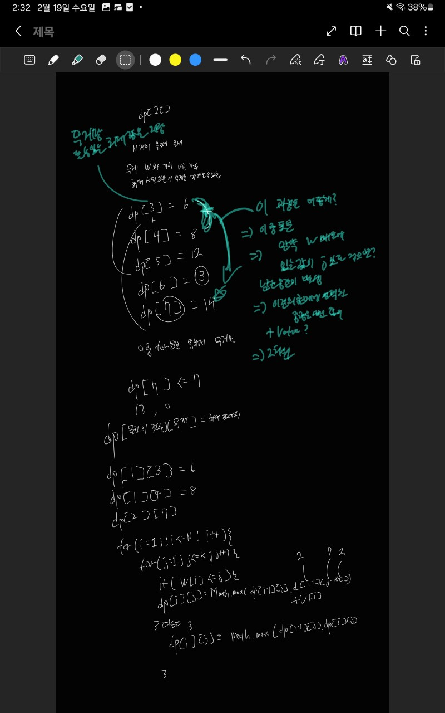

## 문제 링크
* https://www.acmicpc.net/problem/11967


## 시간복잡도

완탐시 2^N = 2^100 완탐불가 

O(N * K) = 100 * 100,000

## 풀이




## 코드
```java
import java.io.BufferedReader;
import java.io.IOException;
import java.io.InputStreamReader;
import java.util.StringTokenizer;

public class Main {
	public static void main(String[] args) throws IOException {
		BufferedReader br = new BufferedReader(new InputStreamReader(System.in));
		StringTokenizer st = new StringTokenizer(br.readLine());
		int N = Integer.parseInt(st.nextToken()); // 물건의 갯수
		int K = Integer.parseInt(st.nextToken()); // 버틸 수 있는 무게
		int[][] dp = new int[101][100_001]; // 2차원 배열을 선택

		int[] weight = new int[N + 1];
		int[] value = new int[N + 1];

		for (int i = 1; i <= N; i++) {
			st = new StringTokenizer(br.readLine());
			int W = Integer.parseInt(st.nextToken());
			int V = Integer.parseInt(st.nextToken());
			weight[i] = W;
			value[i] = V;
		}
		for (int i = 1; i <= N; i++) {
			for (int j = 1; j <= K; j++) {
				if (weight[i] <= j) {
					dp[i][j] = Math.max(dp[i - 1][j], dp[i - 1][j - weight[i]] + value[i]);
				} else {
					dp[i][j] = dp[i - 1][j];
				}
			}
		}
		System.out.println(dp[N][K]);
	}
}
```
## 느낀점
- DP 많이 풀어봐야겠습니다 ㅠㅠ  