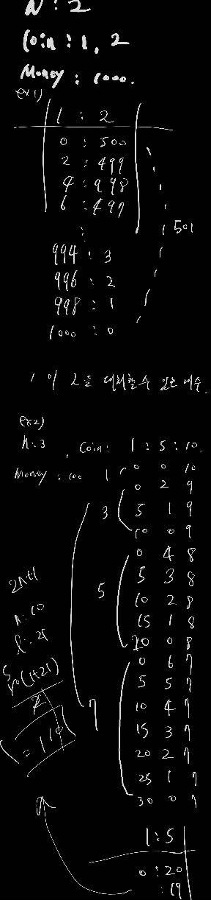

# 백준 9084: 동전

- https://www.acmicpc.net/problem/9084

<br>

## 시간복잡도

- O(N × M)

<br>

## 풀이

- 문제를 보고 combination 발상, 각 동전은 coins[i]는 최대 M/coins[i]개의 선택지를 가진다. N^M/coins[i] -> 완탐 불가능

- 수열을 만들어보면서 이전의 계산을 누적으로 사용할 수 있음
  <br>
  
  <br>

## 어려웠던 부분

<br>

## 코드

```java
import java.io.BufferedReader;
import java.io.BufferedWriter;
import java.io.IOException;
import java.io.InputStreamReader;
import java.io.OutputStreamWriter;
import java.util.ArrayList;
import java.util.List;
import java.util.StringTokenizer;

public class Main {

	public static BufferedReader br = new BufferedReader(
			new InputStreamReader(System.in));
	public static BufferedWriter bw = new BufferedWriter(
			new OutputStreamWriter(System.out));
	public static StringTokenizer st;

	public static int T, N, M;

	public static void main(String[] args) throws IOException {

		List<Integer> result = new ArrayList<Integer>();
		st = new StringTokenizer(br.readLine());
		T = Integer.parseInt(st.nextToken());
		for (int i = 0; i < T; i++) {
			st = new StringTokenizer(br.readLine());
			N = Integer.parseInt(st.nextToken());
			int[] coins = new int[N];

			st = new StringTokenizer(br.readLine());
			for (int j = 0; j < N; j++) {
				coins[j] = Integer.parseInt(st.nextToken());
			}
			st = new StringTokenizer(br.readLine());
			M = Integer.parseInt(st.nextToken());
			int[] dp = new int[M + 1];
			dp[0] = 1;
			for (int coin : coins) {
				for (int j = coin; j <= M; j++) {
					dp[j] += dp[j - coin]; // coin을 사용해서 새로운 합을 만들 수 있음
				}
			}
			result.add(dp[M]);
		}

		for (Integer integer : result) {
			bw.write(integer + "\n");
		}

		br.close();
		bw.close();
	}
}

```
