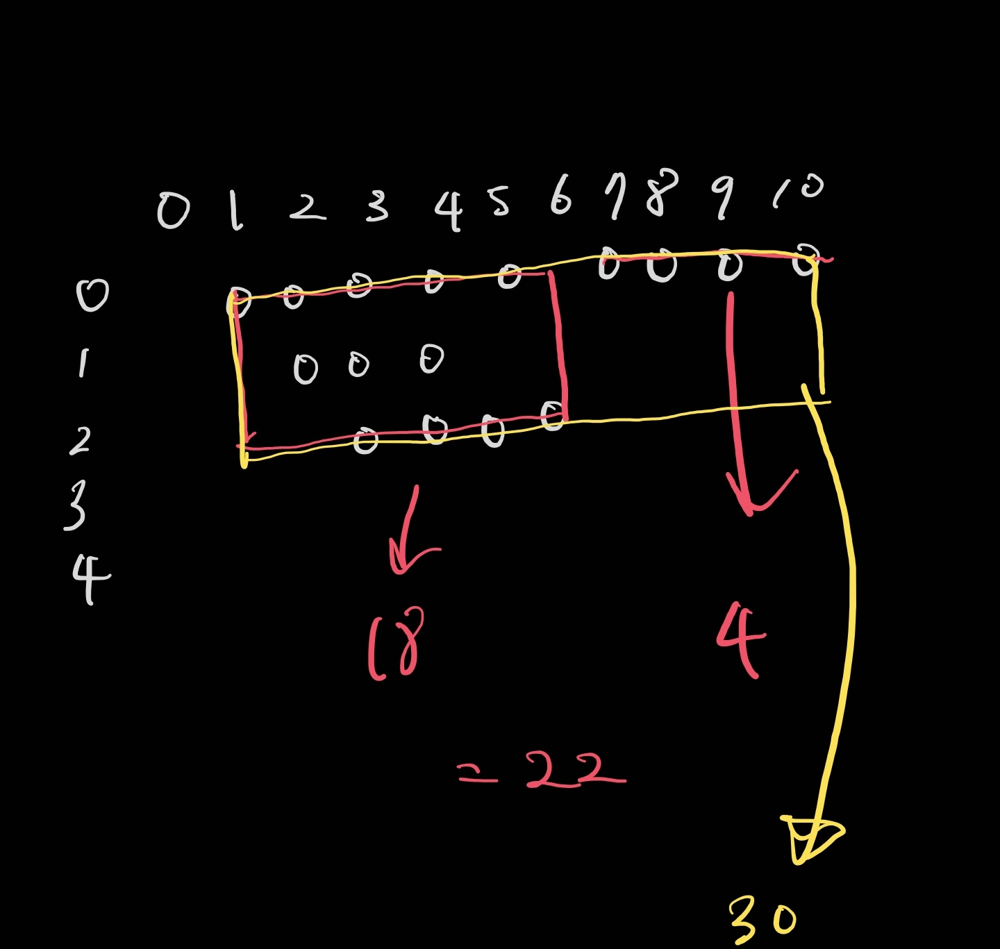

# 백준 20207: 달력

- https://www.acmicpc.net/problem/20207

<br>

## 시간복잡도

- O(NxD)

<br>

## 풀이

- 정렬
  - 시작일순, 길이순
- 직사각형 계산
  - 일마다 일정이 있는지 체크, 있다면 가장 h가 큰 값을 찾는다.
  - 일정이 없는날에 이전 값들을 통해서 넓이를 구합니다.



  <br>

## 부족했던 부분

- 연속된 두 일자에 각각 일정이 1개 이상 있다면 이를 일정이 연속되었다고 표현한다. 의부분을 놓치면 안됐다.
- 위를 놓치고, BFS로 구현 -> 반례 발생 첨부된 이미지 참고

<br>

## 코드

```java
import java.io.BufferedReader;
import java.io.BufferedWriter;
import java.io.IOException;
import java.io.InputStreamReader;
import java.io.OutputStreamWriter;
import java.util.PriorityQueue;
import java.util.StringTokenizer;

public class Main {

	public static BufferedReader br = new BufferedReader(
			new InputStreamReader(System.in));
	public static BufferedWriter bw = new BufferedWriter(
			new OutputStreamWriter(System.out));
	public static StringTokenizer st;
	public static int N;
	public static boolean[][] calendar;
	public static boolean[][] visited;
	public static int[] dx = {-1, 1, 0, 0};
	public static int[] dy = {0, 0, -1, 1};

	// 데이터를 받고, 시간날짜순으로 정렬을 한다. 시작 날짜가 같다면, 종료날짜가 늦을 순으로 정렬
	// 코딩지의 넓이 : 여러 직사각형의 w, h를 구한다.
	// pq에서 일정을 뺀다.

	// 배열에 값을 넣는다
	// x가 0부터 해당 범위 내에 넣을 수 있는지 확인하면서 넣을 수 없다면 x를 ++하여 확인
	// 마지막에 bfs()로 w와 h를 측정?

	// 반례가 생긴이유 : 연속된 두 일자에 각각 일정이 1개 이상 있다면 이를 일정이 연속되었다고 표현한다.
	// bfs 말고, 날짜별로 높이를 계산하고, 연속되는 날짜인지 체크하면됨

	public static void main(String[] args) throws IOException {

		st = new StringTokenizer(br.readLine());
		N = Integer.parseInt(st.nextToken());

		PriorityQueue<int[]> pq = new PriorityQueue<>((o1, o2) -> {
			if (o1[0] == o2[0]) {
				return Integer.compare(o2[1], o1[1]);
			}

			return Integer.compare(o1[0], o2[0]);
		});

		int lastDay = 0;
		for (int i = 0; i < N; i++) {
			st = new StringTokenizer(br.readLine());
			int s = Integer.parseInt(st.nextToken());
			int e = Integer.parseInt(st.nextToken());
			lastDay = Math.max(lastDay, e);
			pq.add(new int[] {s, e});
		}

		calendar = new boolean[N][lastDay + 2];
		while (!pq.isEmpty()) {
			int[] poll = pq.poll();
			// System.out.println("poll = " + Arrays.toString(poll));
			int s = poll[0];
			int e = poll[1];
			for (int i = 0; i < N; i++) {
				if (!calendar[i][s]) {
					for (int j = s; j <= e; j++) {
						calendar[i][j] = true;
					}
					break;
				}
			}
		}

		int result = 0;
		int s = Integer.MAX_VALUE;
		int e = 0;
		int h = 0;
		for (int i = 0; i < calendar[0].length; i++) {
			int maxH = scheduleCheck(i);
			// System.out.println(i + "일 " + maxH + " 높이");
			if (maxH == 0) {
				result += (e - s + 1) * h;
				// System.out.println("넓이 = " + (e - s + 1) * h);
				s = Integer.MAX_VALUE;
				e = 0;
				h = 0;
			} else {
				s = Math.min(s, i);
				e = Math.max(e, i);
				h = Math.max(h, maxH);
			}
		}

		bw.write(result + "");
		bw.close();
		br.close();
	}

	public static int scheduleCheck(int day) {
		int maxH = -1;

		for (int i = 0; i < N; i++) {
			if (calendar[i][day]) {
				maxH = i;
			}
		}

		return maxH + 1;
	}

}
```
