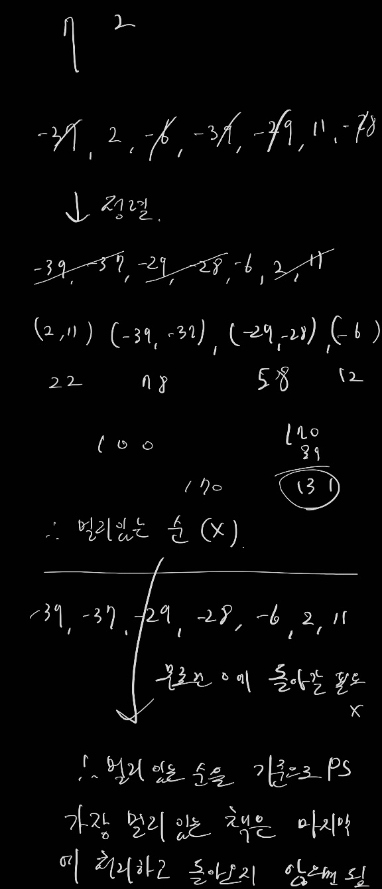

# 백준 1461: 도서관

- https://www.acmicpc.net/problem/1461

<br>

## 시간복잡도

- O(NlogN) 정렬 때문에

<br>

## 풀이

- 음수와 양수를 분리
  - 부호가 다른 M개의 책을 처리한다고 했을 때 결국 0을 지나감으로 별도로 처리한 것과 결과가 같다.
- 거리가 가장 먼 책은 편도로 처리 (그리디)
  - 무조건 다시 0으로 돌아올 필요는 없기 때문에, 가장 결과값을 크게하는 가장 멀리 두어야하는 책을 편도로 처리해야함



  <br>

## 부족했던 부분

- 양수 혹은 음수의 책들로만 구성되 input 이 존재

<br>

## 코드

```java
import java.io.BufferedReader;
import java.io.BufferedWriter;
import java.io.IOException;
import java.io.InputStreamReader;
import java.io.OutputStreamWriter;
import java.util.ArrayList;
import java.util.Collections;
import java.util.StringTokenizer;

public class Main {

	public static BufferedReader br = new BufferedReader(
			new InputStreamReader(System.in));
	public static BufferedWriter bw = new BufferedWriter(
			new OutputStreamWriter(System.out));
	public static StringTokenizer st;
	public static int N, M;
	public static StringBuilder result = new StringBuilder();

	// M개의 책을 함께 가져갈 수 있다.
	// 무조건 다시 0으로 돌아올 필요는 없다. -> 하지만 남은 책을 다시 가지러가야함
	// 부호가 다르면 어차피 0을 지나감으로 따로가나 같이 들고가나 의미가 없음 따라서 그냥 별도로 처리한다고 봐야함

	// 가장 절대값이 큰 부호를 먼저 처리하면서 그 뒤로 작은 M-1개를 같이 처리 -> 편도 거리만 증가시킴

	// 나머지는 M개씩 묶어서 가장 큰 값으로 왕복처리
	// 다른 부호도 M개씩 묶어서 가장 큰 값을 왕복처리

	public static void main(String[] args) throws IOException {
		int result = 0;

		st = new StringTokenizer(br.readLine());
		N = Integer.parseInt(st.nextToken());
		M = Integer.parseInt(st.nextToken());

		ArrayList<Integer> plus = new ArrayList<>();
		ArrayList<Integer> minus = new ArrayList<>();

		st = new StringTokenizer(br.readLine());
		for (int i = 0; i < N; i++) {
			int num = Integer.parseInt(st.nextToken());
			if (num > 0) {
				plus.add(num);
			} else {
				minus.add(num);
			}
		}

		Collections.sort(plus);
		Collections.sort(minus);

		int plusMax = 0;
		int minusMax = 0;

		if (!plus.isEmpty()) {
			plusMax = plus.get(plus.size() - 1);
		}

		if (!minus.isEmpty()) {
			minusMax = minus.get(0) * -1;
		}
		// 가장 큰 책 편도로 제거
		if (plusMax > minusMax) {
			for (int i = 0; i < M; i++) {
				if (!plus.isEmpty()) {
					plus.remove(plus.size() - 1);
				}
			}

			result += plusMax;
		} else {
			for (int i = 0; i < M; i++) {
				if (!minus.isEmpty()) {
					minus.remove(0);
				}
			}

			result += minusMax;
		}

		while (!plus.isEmpty()) {
			int distance = plus.get(plus.size() - 1);
			result += distance * 2;

			for (int i = 0; i < M; i++) {
				if (plus.isEmpty()) {
					break;
				}
				plus.remove(plus.size() - 1);
			}
		}

		while (!minus.isEmpty()) {
			int distance = minus.get(0);
			result += distance * 2 * -1;

			for (int i = 0; i < M; i++) {
				if (minus.isEmpty()) {
					break;
				}
				minus.remove(0);
			}
		}

		bw.write(result + "");
		bw.close();
		br.close();
	}
}


```
