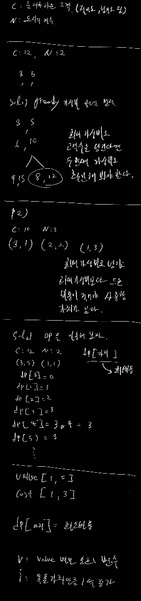
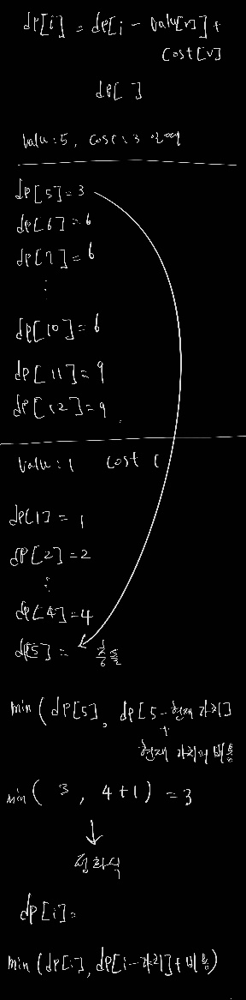

# 백준 1106: 호텔

- https://www.acmicpc.net/problem/1106

<br>

## 시간복잡도

- O(NxC)

<br>

## 풀이

- dp
- 수를 나열하면서 선택지가 나왔을 때 이전의 계산 값을 재사용
  <br>
  
  
  <br>

## 부족했던부분

- 적어도 C명 늘이기 위해 형택이가 투자해야 하는 돈의 최솟값 에서 '적어도' 키워드
  - C명을 초과했지만 더 최소비용이 적은 값이 존재할 수 있음
- 범위는 어떻게 정의할 것인가?
  - 가장 많은 고객을 늘리는 케이스의 배수로 C보다 커지는 케이스가 최소비용이 나오면서 고객의 C를 초과하는 범위

<br>

## 코드

```java
import java.io.BufferedReader;
import java.io.BufferedWriter;
import java.io.IOException;
import java.io.InputStreamReader;
import java.io.OutputStreamWriter;
import java.util.Arrays;
import java.util.StringTokenizer;

public class Main {

	public static BufferedReader br = new BufferedReader(
			new InputStreamReader(System.in));
	public static BufferedWriter bw = new BufferedWriter(
			new OutputStreamWriter(System.out));
	public static StringTokenizer st;
	public static int N, C, maxValue;
	public static int[] values, costs, dp;

	public static void main(String[] args) throws IOException {

		// 각 도시별 비용과 가치가 주어짐
		// 특정 가치에 대해서 최소 비용으로 해결 -> 냅색
		// 적어도라는 발언 때문에 특정 고객수는 넘었지만 더 최소비용이 적은 경우의 수를 따져야한다.
		// end 점의 최대는 가장 큰 값으로 정수배를 했을 때 C를 넘는 최초의 수가

		st = new StringTokenizer(br.readLine());
		C = Integer.parseInt(st.nextToken());
		N = Integer.parseInt(st.nextToken());

		values = new int[N];
		costs = new int[N];

		for (int i = 0; i < N; i++) {
			st = new StringTokenizer(br.readLine());
			int cost = Integer.parseInt(st.nextToken());
			int value = Integer.parseInt(st.nextToken());
			costs[i] = cost;
			values[i] = value;
			maxValue = Math.max(value, maxValue);
		}

		while (maxValue <= C) {
			maxValue += maxValue;
		}

		dp = new int[maxValue + 1];
		Arrays.fill(dp, Integer.MAX_VALUE/2);
		dp[0] = 0;

		for (int i = 0; i < N; i++) {
			for (int j = values[i]; j < dp.length; j++) {
				dp[j] = Math.min(dp[j], dp[j - values[i]] + costs[i]);
				// System.out.println("dp[j] = " + dp[j]);
			}
		}

		int result = Integer.MAX_VALUE;
		for (int i = C; i < maxValue + 1; i++) {
			result = Math.min(result, dp[i]);
		}

		bw.write(result + "");
		bw.close();
		br.close();
	}

}
```
