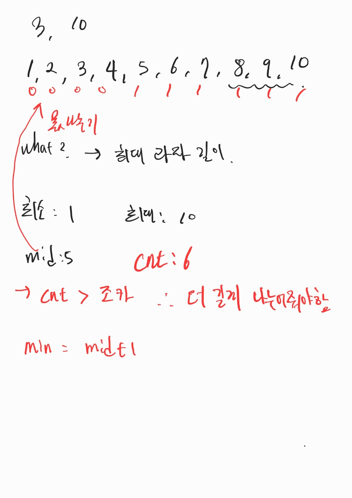
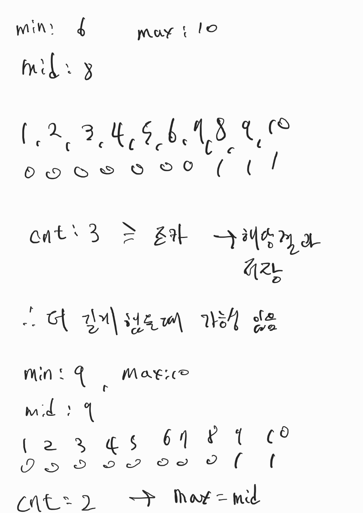

# # 백준 16401: 과자 나눠주기

- https://www.acmicpc.net/problem/16401

<br>

## 시간복잡도

- O(NlogM)

<br>

## 풀이

- M, N <= 1,000,000 -> nlogn 이하로 끝내야함
- 이분탐색
  - 특정 길이에 대해서 몇 개의 과자를 나누어 줄 수 있는가?
  - 조카 < cnt 라면 과자를 더 길게
  - 조카 > cnt 라면 과자를 더 짧게
  - 길이 조절을 이분탐색을 통해서 빠르게 결과 값을 찾는다.
    <br>


<br>


<br>

## 부족했던 부분

- 이분탐색을 하려는 기준을 못 잡았음
  - 과자를 소거하거나 특정 과자를 나눠서 새로운 배열을 만드려고 했음

<br>

## 코드

```java
import java.util.*;
import java.io.BufferedReader;
import java.io.BufferedWriter;
import java.io.IOException;
import java.io.InputStreamReader;
import java.io.OutputStreamWriter;
import java.util.StringTokenizer;

public class Main {

	public static BufferedReader br = new BufferedReader(
			new InputStreamReader(System.in));
	public static BufferedWriter bw = new BufferedWriter(
			new OutputStreamWriter(System.out));
	public static StringTokenizer st;
	public static int M, N;
	public static int[] snacks;

	public static void main(String[] args) throws IOException {

		st = new StringTokenizer(br.readLine());
		M = Integer.parseInt(st.nextToken());
		N = Integer.parseInt(st.nextToken());

		// M, N <= 1,000,000 -> nlogn 이하로 끝내야함
		// 최소는 1, 최대는 가장 긴 과자
		// 중간 값 = (min + max) / 2
		// 몫으로 나누면서 cnt가 M보다 크거나 같다면 mid를 길게 min = mid + 1
		// 작다면 mid를 작게 max = mid
		// min > max 까지 진행

		st = new StringTokenizer(br.readLine());
		snacks = new int[N];
		int min = 1;
		int max = Integer.MIN_VALUE;
		for (int i = 0; i < N; i++) {
			int snack = Integer.parseInt(st.nextToken());
			snacks[i] = snack;
			max = Math.max(max, snack);
		}

		int result = 0;
		while (min <= max) {
			int mid = (max + min) / 2;
			int cnt = 0;
			for (int i = 0; i < N; i++) {
				cnt += snacks[i] / mid;
			}

			if (cnt >= M) {
				min = mid + 1;
				result = Math.max(result, mid);
			} else {
				max = mid - 1;
			}
		}

		bw.write(result + "");
		bw.close();
		br.close();
	}

}
```
