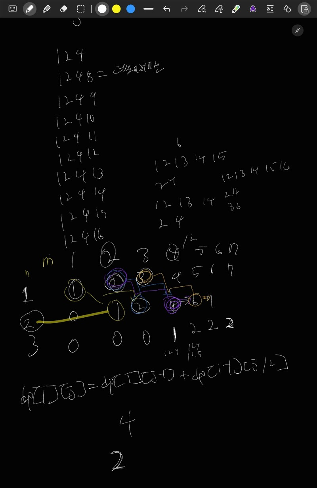

# 로또

- https://www.acmicpc.net/problem/2758

<br>

## 시간복잡도

- O(N*M)

<br>

## 풀이



<br>

## 부족했던 부분


<br>

## 코드

```java
package beakjoon;

import java.io.BufferedReader;
import java.io.BufferedWriter;
import java.io.IOException;
import java.io.InputStreamReader;
import java.io.OutputStreamWriter;
import java.util.Arrays;
import java.util.StringTokenizer;

public class Boj2758 {
	public static void main(String[] args) throws IOException {
		BufferedReader br = new BufferedReader(new InputStreamReader(System.in));
		BufferedWriter bw = new BufferedWriter(new OutputStreamWriter(System.out));
		int T = Integer.parseInt(br.readLine());
		int[][] dp = new int[11][2001];
		Arrays.fill(dp[1], 1);
		dp[1][0] = 0;
		for (int i = 1; i <= 10; i++) {
			for (int j = (int)Math.pow(2, i - 1); j <= 2000; j++) {
				dp[i][j] += dp[i - 1][j / 2];
				dp[i][j] += dp[i][j - 1];
			}
		}
		while (T-- > 0) {
			StringTokenizer st = new StringTokenizer(br.readLine());
			int N = Integer.parseInt(st.nextToken()); // 로또의 길이
			int M = Integer.parseInt(st.nextToken()); // 최대 로또의 숫자값
			bw.write(dp[N][M] + "\n");
		}
		bw.flush();
		bw.close();
	}
}

```
