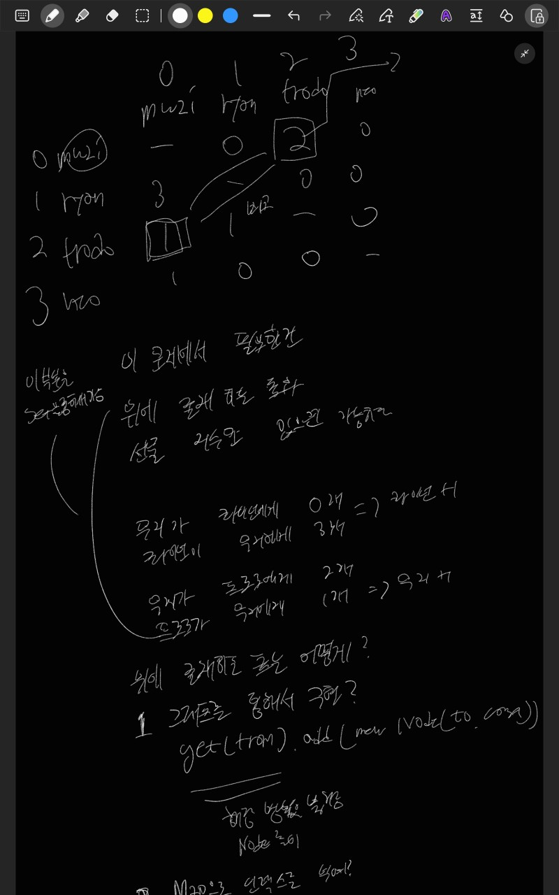

# 프로그래머스: 가장 많이 받은 선물
* https://school.programmers.co.kr/learn/courses/30/lessons/258712

<br>

## 시간복잡도
- 2 ≤ friends의 길이 = 친구들의 수 ≤ 50
- 1 ≤ gifts의 길이 ≤ 10,000

O(N^2 * gifts)
<br>

## 풀이


입출력 예 에서 주어진 2차원 행렬을 구현하면 문제를 풀 수 있다고 생각하여
그래프를 만들어서 해당 문제룰 풀었습니다.

<br>

## 어려웠던 부분
* 문제가 String 을 기반으로 선물을 주고받는 작업을 하기떄문에 처음에는 그래프로는 힘들겠다고 생각했지만 그냥 idx로 치환해서 하면 되겠다 라고 생각을 해서 문제를 풀 수 있었습니다


<br>

## 코드
```java
cimport java.util.*;
class Solution {
    public int solution(String[] friends, String[] gifts) {
        // 구현
        // 해시맵을 통해서 선물 지수를 표현가능 
        boolean[][] visited = new boolean[friends.length][friends.length];
        Map<String,Integer> gift = new HashMap<>(); // 선물지수확인
        Set<String> check = new HashSet<>(); // 둘이 서로 교환했는지 체크
        Map<String,Integer> ts = new HashMap<>(); // 인덱스역할을함
        Map<Integer,Integer> result = new HashMap<>();
        Map<Integer,String> reverse = new HashMap<>();
        List<List<Node>> graph = new ArrayList<>(); // 그래프로 만들어서 
        for(int i = 0 ; i < friends.length; i++){
            gift.put(friends[i],0);
            ts.put(friends[i],i);
            graph.add(new ArrayList<>());
            result.put(i,0);
            reverse.put(i,friends[i]);
        }
        
        Arrays.sort(gifts);
        int temp = 0;
        
        // System.out.println(Arrays.toString(gifts));
        while(temp < gifts.length){
            String currGift = gifts[temp];
            String[] arr = currGift.split(" ");
            String from = arr[0];
            String to = arr[1];
            int fromIdx = ts.get(from);
            int toIdx = ts.get(to);
            int cnt = 0;
            while(temp < gifts.length && currGift.equals(gifts[temp])){
                // System.out.println("currGift = " + currGift);
                // System.out.println("gifts =  " + gifts[i]);
                cnt++;
                temp++;
            }
            visited[fromIdx][toIdx] = true;
            graph.get(fromIdx).add(new Node(toIdx,cnt)); // 그래프로 표현
            gift.put(from,gift.getOrDefault(from,0)+cnt); // 선물을 준사람은 지수를 올림
            gift.put(to,gift.getOrDefault(to,0)-cnt); // 받은 사람은 지수를 내림
        }
        
        // 안이어진 노드들 이어주기 
        for(int i = 0 ; i < friends.length ; i++){
            for(int j = 0 ; j < friends.length; j++){
                if(i != j && !visited[i][j]) {
                    graph.get(i).add(new Node(j, 0));
                }
            }
        }
        
        // 다음 달에 받을 선물 계산
        for(int i = 0; i < friends.length; i++) {
            for(int j = 0; j < friends.length; j++) {
                if(i == j) continue; // 자기 자신은 건너뜀
                
                // i -> j 관계 찾기
                int iToJ = 0;
                for(Node node : graph.get(i)) {
                    if(node.to == j) {
                        iToJ = node.cost;
                        break;
                    }
                }
                
                // j -> i 관계 찾기
                int jToI = 0;
                for(Node node : graph.get(j)) {
                    if(node.to == i) {
                        jToI = node.cost;
                        break;
                    }
                }
                
                // 선물 규칙 적용
                if(iToJ > jToI) {
                    // i가 j에게 더 많은 선물을 줬으면 i가 선물을 받음
                    result.put(i, result.get(i) + 1);
                } else if(iToJ == jToI) {
                    // 선물을 주고 받은 개수가 같거나 주고 받은 적이 없는 경우
                    String nameI = reverse.get(i);
                    String nameJ = reverse.get(j);
                    
                    if(gift.get(nameI) > gift.get(nameJ)) {
                        // i의 선물 지수가 더 높으면 i가 선물을 받음
                        result.put(i, result.get(i) + 1);
                    }
                }
            }
        }
        
        int answer = 0;
        for(int count : result.values()) {
            answer = Math.max(answer, count);
        }
        
        return answer;
    }
    private static class Node{
        Integer to;
        Integer cost;
        public Node(Integer to, Integer cost){
            this.to = to;
            this.cost = cost;
        }
        @Override
        public String toString(){
            return "to = " + this.to + " cost = " + this.cost;
        }
    }
}
```

