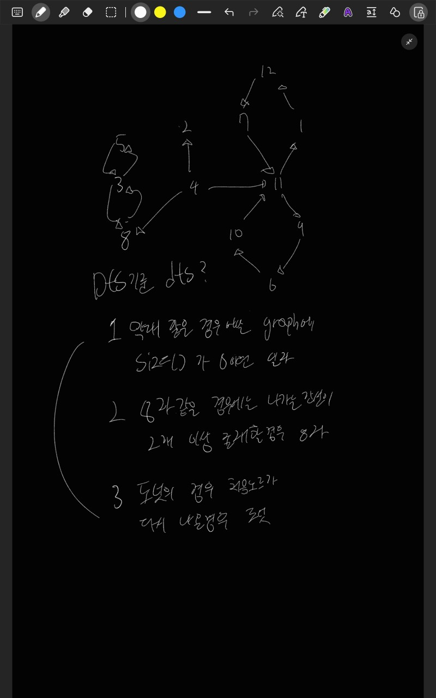

# 프로그래머스: 도넛과 막대 그래프
* https://school.programmers.co.kr/learn/courses/30/lessons/258711

<br>

## 시간복잡도
- 1 ≤ edges의 길이 ≤ 1,000,000
- 1 ≤ a, b ≤ 1,000,000

O(N)

<br>

## 풀이



<br>

## 어려웠던 부분
 
  * 예제에서는 노드들의 인덱스 번호가 오름차순으로 되어있지만 아닌 경우도 존재합니다 그래서 해당 런타임 에러가 나더라고요 ㅠ
  * 저같은 경우에는 나가는 간선이 가장 많은 노드를 시작 노드로 하였는데 실제 시작노드보다 나가는 간선이 많은 노드가 존재해서 다른 노드를 시작노드를 잡은 케이스가 존재해서 이 케이스 때문에 시간이 많이 오래걸렸습니다

<br>

## 코드
```java
import java.util.*;
class Solution {
    static int makdae,eight ,donut = 0;
    static List<List<Integer>> graph;
    static boolean[] visited;
    static int N;
    public int[] solution(int[][] edges) {
        Set<Integer> set = new HashSet<>();
        N = edges.length;
        graph = new ArrayList<>();
        visited = new boolean[1_000_001];
        
        for(int i = 0 ; i <= 1_000_000 ; i++){
            graph.add(new ArrayList<>());
        }
        int maxNode = 0;
        for(int i = 0; i < N; i++){
            int from = edges[i][0];
            int to = edges[i][1];
            set.add(to);
            graph.get(from).add(to);
            maxNode = Math.max(maxNode,Math.max(from,to));
        }
        int startNode = 0;
        for(int i = 1; i <= maxNode; i++){
            if(!set.contains(i) && graph.get(i).size() >= 2){
                startNode = i;
            }
        }
        
        visited[startNode] = true;
        for(Integer next : graph.get(startNode)){
                logic(next);
            }
        return new int[]{startNode,donut,makdae,eight};
    }
    private static void logic(Integer node){
        Queue<Integer> stack = new ArrayDeque<>();
        stack.offer(node);
        int startNode = node;
        visited[node] = true;
        while(!stack.isEmpty()){
            int curr = stack.poll();
            for(Integer next : graph.get(curr)){
                if(graph.get(next).size() >= 2) {
                    eight++;
                    return;
                } 
                if(startNode == next) {
                    donut++;
                    return;
                }
                if(!visited[next]){
                    visited[next] = true;
                    stack.offer(next);
                }
            }
        }
        makdae++;
    }
}
```

