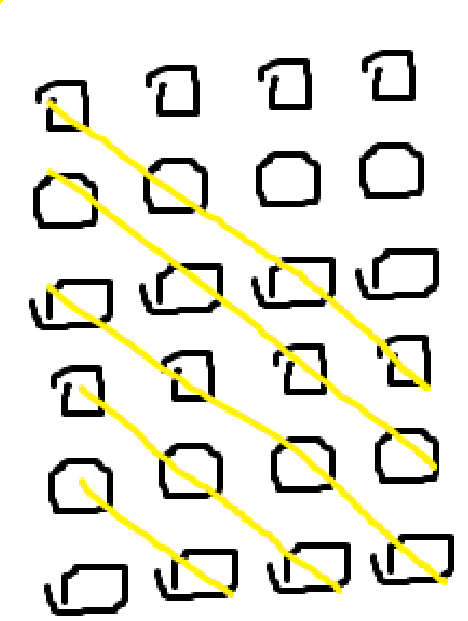
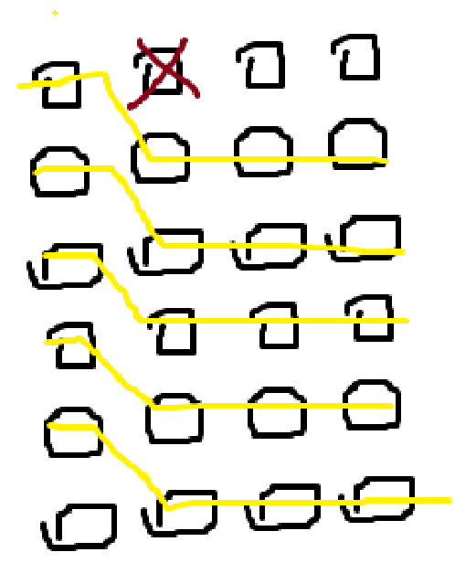

# 문제링크
* https://www.acmicpc.net/problem/3109

<br>

## 시간복잡도

1 ≤ R ≤ 10,000, 5 ≤ C ≤ 500

10,000 * 500

## 풀이

문제에서도 적혀있듯이 왼쪽 1열부터 시작하여 오른쪽 끝인 M열 까지 파이프를 최대 몇개까지 설치할 수 있는지에 대한 문제입니다.


이런 격자가 주어졌을경우 대부분은 **BFS, DFS**입니다. 저는 여기서 **DFS**를 쳬택하였습니다.


이유는 아래와 같습니다.


1. **최단 경로**를 구하는 문제가아님
2. 격자판이 최대 **10,000 * 500** 이므로 메모리 초과할 수 도 있음


이러한 이유 때문에 DFS 로 구현하였습니다.

이제 어떻게 DFS로 해당 문제를 풀 것이냐 입니다. 문제에서는 아래와 같은 전제조건이 주어집니다.


1. 이동은 **우상, 우 , 우하** 3가지의 방법으로 움직일 수 있다.
2. 'x' 로 되어있는 곳은 방문할 수 없다. 
3. 경로는 겹칠 수 없고, 서로 접할 수도 없다. 즉, 각 칸을 지나는 파이프는 하나이어야 한다. 
4. 모든 파이프라인은 첫째 열에서 시작해야 하고, 마지막 열에서 끝나야 한다. 
5. 설치할 수 있는 파이프라인의 최대 개수를 구해야한다.

이 문제의 핵심은 주인공이 최대한  파이프라인을 많이 설치 해야 된다 입니다.

그럼 어떻게 DFS를 통해서 최대한 많은 파이프라인을 설치하냐 입니다.

해결책으로는 위에서 주어진 이동 경로를 최대한 효율적으로 움직이게 하는것입니다.







<br>

## 어려웠던 부분
* 위와같은 그림을 통해 효율적인 움직음을 기반으로 문제를 푼다는 개념을 찾는 부분이 시간이 걸렸습니다.

<br>

## 코드
```java
package beakjoon;

import java.io.BufferedReader;
import java.io.IOException;
import java.io.InputStreamReader;
import java.util.StringTokenizer;

public class Boj3109 {
    static int N, M;
    static char[][] arr;
    static int[][] moves = new int[][] {{-1, 1}, {0, 1}, {1, 1}}; // 우상, 우, 우하
    static int result = 0;

    public static void main(String[] args) throws IOException {
        BufferedReader br = new BufferedReader(new InputStreamReader(System.in));
        StringTokenizer st = new StringTokenizer(br.readLine());

        N = Integer.parseInt(st.nextToken());
        M = Integer.parseInt(st.nextToken());
        arr = new char[N][M];

        for (int i = 0; i < N; i++) {
            arr[i] = br.readLine().toCharArray();
        }
        for (int i = 0; i < N; i++) {
            dfs(i, 0);
        }
        System.out.println(result);
    }

    private static boolean dfs(int x, int y) {
        if (y == M - 1) {
            result++;
            return true;
        }
        for (int[] move : moves) {
            int nx = x + move[0];
            int ny = y + move[1];
            if (nx < 0 || nx >= N || ny >= M) continue;
            if (arr[nx][ny] == '.') {
                arr[nx][ny] = 'x';
                if (dfs(nx, ny)) return true;
            }
        }
        return false;
    }
}
```

