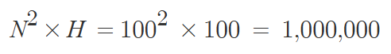

# 문제링크
* https://www.acmicpc.net/problem/2468

<br>

## 시간복잡도


## 풀이

전형적인 BFS 문제입니다.

격자판이 주어지고 해당 1~100 이라는 높이가 주어졌을때 높이가 어느 경우에 가장 안전구역이 많이 생기는지에 대한 문제입니다.


그리하여 BFS 알고리즘을 구현하고 주어진 제한사항을 기반으로 문제를 풀었습니다.


N은 최대 100이며 해당 높이도 100이기 떄문에 시간복잡도는 아래와 같습니다


## 코드
```java

import java.io.BufferedReader;
import java.io.IOException;
import java.io.InputStreamReader;
import java.util.ArrayDeque;
import java.util.Queue;
import java.util.StringTokenizer;

public class Main {
    static int N;
    static int[][] arr;
    static int[][] moves = new int[][] {{0, 1}, {1, 0}, {0, -1}, {-1, 0}};
    static boolean[][] visited;

    public static void main(String[] args) throws IOException {
        BufferedReader br = new BufferedReader(new InputStreamReader(System.in));
        N = Integer.parseInt(br.readLine());
        arr = new int[N][N];
        int maxHeight = 0;
        for (int i = 0; i < N; i++) {
            StringTokenizer st = new StringTokenizer(br.readLine());
            for (int j = 0; j < N; j++) {
                int max = Integer.parseInt(st.nextToken());
                arr[i][j] = max;
                maxHeight = Math.max(maxHeight, max);
            }
        }
        int result = 0;
        for (int h = 0; h <= maxHeight; h++) {
            int cnt = 0;
            visited = new boolean[N][N];
            for (int i = 0; i < N; i++) {
                for (int j = 0; j < N; j++) {
                    if (arr[i][j] > h && !visited[i][j]) {
                        visited[i][j] = true;
                        bfs(i, j, h);
                        cnt++;
                    }
                }
            }
            result = Math.max(cnt, result);
        }
        System.out.println(result);
    }

    private static void bfs(int x, int y, int h) {
        Queue<int[]> q = new ArrayDeque<>();
        q.offer(new int[] {x, y});
        while (!q.isEmpty()) {
            int[] curr = q.poll();
            for (int[] move : moves) {
                int nx = move[0] + curr[0];
                int ny = move[1] + curr[1];
                if (nx < 0 || ny < 0 || nx >= N || ny >= N) continue;
                if (arr[nx][ny] > h && !visited[nx][ny]) {
                    visited[nx][ny] = true;
                    q.offer(new int[] {nx, ny});
                }
            }
        }
    }

    private static void prt(Object o) {
        System.out.println(o);
    }
}
```

