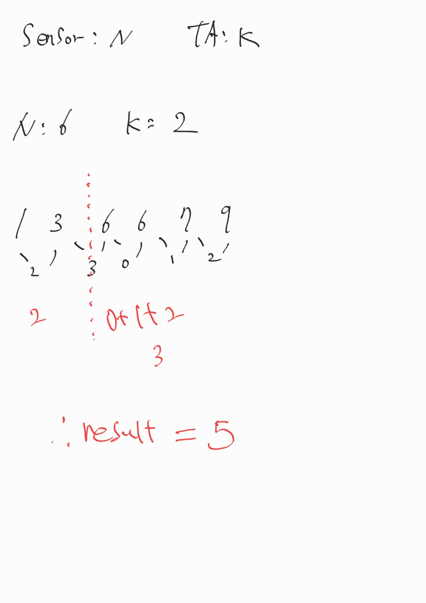

# 문제링크

- https://www.acmicpc.net/problem/2468

<br>

## 시간복잡도

정렬 알고리즘
O(nlogn)

## 풀이

정렬과 그리디(Greedy) 알고리즘을 활용합니다.

1. 센서들을 정렬하고, 인접 센서들 사이의 간격(거리)을 모두 구합니다.
2. 이 중에서 가장 큰 간격 (K-1개)를 제거하면 센서들을 K개의 그룹으로 나눌 수 있습니다.
3. 각 그룹은 하나의 집중국이 커버하고, 그 커버 길이의 총합이 최소가 됩니다.

- 이유: 가장 큰 간격부터 끊어주면, 길이가 긴 커버 영역을 없애고, 더 작은 거리들만 남기게 되어 최적의 결과를 얻을 수 있기 때문입니다.
  

## 코드

```java
import java.io.BufferedReader;
import java.io.BufferedWriter;
import java.io.IOException;
import java.io.InputStreamReader;
import java.io.OutputStreamWriter;
import java.util.Arrays;
import java.util.PriorityQueue;
import java.util.StringTokenizer;

public class Main {

	public static BufferedReader br = new BufferedReader(
			new InputStreamReader(System.in));
	public static BufferedWriter bw = new BufferedWriter(
			new OutputStreamWriter(System.out));
	public static StringTokenizer st;
	public static int N, K, result;
	public static int[] map;

	public static void main(String[] args) throws IOException {
		/**
		 * 최대 K개
		 * N개의 센서가 적어도 하나의 집중국과는 통신이 가능해야함
		 * 집중국의 수신 가능 영역의 길이의 합을 최소화
		 *
		 * 좌표의 절대값이 10^6 -> 순회 X (조합 x)
		 *
		 * 1. 센서 위치 정렬
		 * 2. 각 센서의 거리를 측정
		 * 3. k >= 2 가장 큰 거리 부분을 영역 분리(해당 부분 제거)
		 * 4. k == 1, 각 거리를 다 더하면 result
		 *
		 */
		N = Integer.parseInt(br.readLine());
		K = Integer.parseInt(br.readLine());
		String[] str = br.readLine().split(" ");
		map = new int[N];
		for (int i = 0; i < N; i++) {
			map[i] = Integer.parseInt(str[i]);
		}
		Arrays.sort(map);

		PriorityQueue<Integer> pq = new PriorityQueue<>((o1, o2) -> o2 - o1);
		for (int i = 1; i < map.length; i++) {
			pq.add(Math.abs(map[i] - map[i - 1]));
		}

		while (K >= 2) {
			pq.poll();
			K--;
		}

		while (!pq.isEmpty()) {
			result += pq.poll();
		}

		bw.write(result + "");

		bw.close();
		br.close();
	}

}
```
