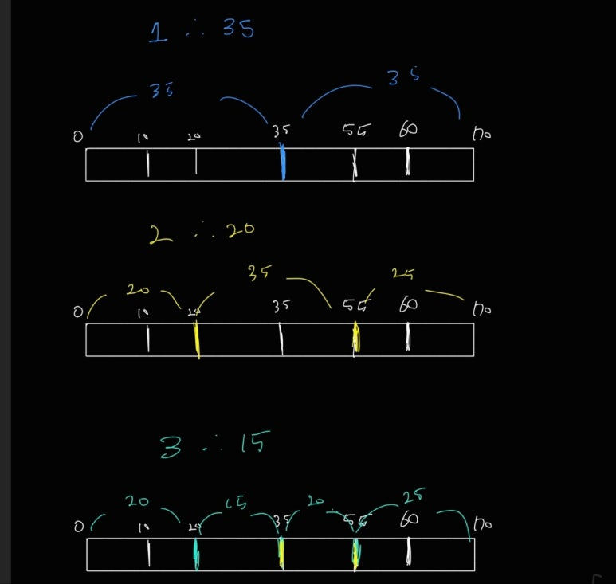

# 백준 17179번: 케이크 자르기 
* https://www.acmicpc.net/problem/17179

<br>

## 시간복잡도
* 1 ≤ N ≤ M ≤ 1,000, 1 < L ≤ 4,000,000
* O(N × log L × M) = 약 22,000,000

<br>

## 풀이
* 이분 탐색


"최적의 길이'를 매개변수로 선택하여 해당 최적의 길이를 기반으로 Q+1의 케이크가 생길 수 있는지에 대해서 로직을 구현하였습니다.

매개변수 탐색의 중요한 점은 아래와 같습니다.

- mid 값을 어떤 기준으로 둘것인가 
  - 여기서는 "조각의 최소 길이"입니다. 
- 하한 / 상한을 확실히 구분하라.
  - 이 문제는 조건을 만족하는 최대값(mid)을 구하는 상한 문제이므로 만족하면 left = mid + 1, 아니라면 right = mid - 1 


## 어려웠던 부분
* 이분 탐색의 대상
  * 이분 탐색의 대상이 해당 인덱스가 될 수 도 있으며 해당 인덱스의 존재하는 값이 될 수 도 있습니다 그리하여 mid값을 무엇을 기준으로 두는지에 대해서 이 부분이 가장 어렵게 느겨집니다.


## 코드
```java
package beakjoon;

import java.io.BufferedReader;
import java.io.BufferedWriter;
import java.io.IOException;
import java.io.InputStreamReader;
import java.io.OutputStreamWriter;
import java.util.Arrays;
import java.util.StringTokenizer;

public class Boj17179 {
  static int[] cakes;

  public static void main(String[] args) throws IOException {
    BufferedReader br = new BufferedReader(new InputStreamReader(System.in));
    BufferedWriter bw = new BufferedWriter(new OutputStreamWriter(System.out));
    StringTokenizer st = new StringTokenizer(br.readLine());

    int N = Integer.parseInt(st.nextToken()); // 자르는 횟수 목록의 길이
    int M = Integer.parseInt(st.nextToken()); // 자를 수 있는 지점 수
    int L = Integer.parseInt(st.nextToken()); // 케이크 길이

    cakes = new int[M + 2];
    for (int i = 1; i <= M; i++) {
      cakes[i] = Integer.parseInt(br.readLine());
    }
    cakes[0] = 0;
    cakes[M + 1] = L;

    int[] commands = new int[N];
    for (int i = 0; i < N; i++) {
      commands[i] = Integer.parseInt(br.readLine());
    }
    Arrays.sort(cakes);
    for (int command : commands) {
      int left = 1;
      int right = L;
      int result = 0;
      while (left <= right) {
        int mid = (left + right) / 2;
        if (isCut(mid, command + 1)) {
//          System.out.println(mid);
          result = mid;
          left = mid + 1;
        } else {
          right = mid - 1;
        }
      }
      bw.write(result + "\n");
    }
    bw.flush();
    bw.close();
  }

  private static boolean isCut(int mid, int pieceCake) {
    int last = 0;
    int cnt = 0;
    for (int i = 1; i < cakes.length; i++) {
      if (mid <= cakes[i] - cakes[last]) {
        cnt++;
        last = i;
      }
    }
    return cnt >= pieceCake;
  }
}

```

