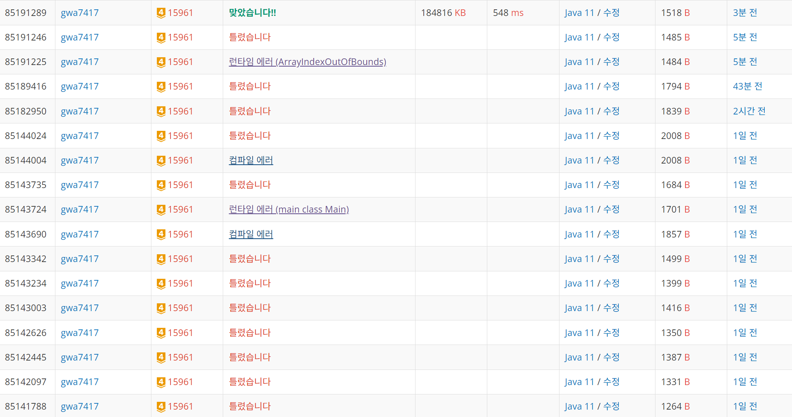

# 문제 링크
https://www.acmicpc.net/problem/15961

---

## 문제 설명

원래 회전 초밥은 손님이 마음대로 초밥을  고르고, 먹은 초밥만큼 식대를 계산하지만, 벨트의 임의의 한 위치부터 k개의 접시를 연속해서 먹을 경우 할인된 정액 가격으로 제공한다.

각 고객에게 초밥의 종류 하나가 쓰인 쿠폰을 발행하고, 1번 행사에 참가할 경우 이 쿠폰에 적혀진 종류의 초밥 하나를 추가로 무료로 제공한다. 만약 이 번호에 적혀진 초밥이 현재 벨트 위에 없을 경우, 요리사가 새로 만들어 손님에게 제공한다.

위 할인 행사에 참여하여 가능한 한 다양한 종류의 초밥을 먹으려고 한다. 위 그림의 예를 가지고 생각해보자. k=4이고, 30번 초밥을 쿠폰으로 받았다고 가정하자. 쿠폰을 고려하지 않으면 4가지 다른 초밥을 먹을 수 있는 경우는 (9, 7, 30, 2), (30, 2, 7, 9), (2, 7, 9, 25) 세 가지 경우가 있는데, 30번 초밥을 추가로 쿠폰으로 먹을 수 있으므로 (2, 7, 9, 25)를 고르면 5가지 종류의 초밥을 먹을 수 있다.

---


## 문제 접근 과정

1. 처음에는 큐를 활용하여 풀려고 하였습니다 하지만 실패하여 투포인터를 활용하여 풀려고 노력하였습니다
---


## 시간복잡도

처음에는 `콤비네이션`을 활용할려고 하였으나 최대 레일에 올라간 접시의 갯수 `N`이  `3,000,000` 
이기 떄문에 `N^2` 은 절대 안된다고 생각하였으며

이렇게 N이 높은 문제는 `BigO(N)` 이내로 풀어야 한다고 느꼇습니다 그리하여 투포인터를 선정하였습니다

## 코드
```java
// 큐를 활용한 방법
 
public class Main {
	public static void main(String[] args) throws IOException {
		BufferedReader br = new BufferedReader(new InputStreamReader(System.in));
		StringTokenizer st = new StringTokenizer(br.readLine());
		int N = Integer.parseInt(st.nextToken()); // 회전벨트에 놓인 접시의 수
		int d = Integer.parseInt(st.nextToken()); // 초밥의 가짓수
		int k = Integer.parseInt(st.nextToken()); // 연속해서 먹는 접시의 수
		int c = Integer.parseInt(st.nextToken()); // 쿠폰 번호

		int max = 0;
		Queue<Integer> q = new LinkedList<>();

		for (int i = 0; i < N; i++) {
			int value = Integer.parseInt(br.readLine()); // 현재 들어오는 초밥 값

			if (!q.contains(value) && q.size() < k) {
				q.offer(value); // 큐에 초밥 추가

				// 쿠폰값을 계속해서 업데이트 해줘야함
				if (!q.contains(c)) {
					max = Math.max(max, q.size() + 1);
				} else {
					max = Math.max(max, q.size()); // 최대 값 업데이트
				}

				// 큐가 k개일 때 쿠폰 초밥이 없으면 +1
				if (q.size() == k && !q.contains(c)) {
					System.out.println(k + 1); // 쿠폰 초밥을 포함한 최대 초밥 수
					return;
				}
			} else {
				// 큐가 k개를 유지하기 위해 초과된 경우 제거
				if (q.size() == k) {
					q.poll();
				}

				// 큐에 중복된 값이 있으면 해당 값 제거
				// 왜냐하면 중복된 값이 들어온 순간 연속적으로 먹는것이 의미가 없으므로 중복된 값이 나올때 까지 빼줌
				while (q.contains(value)) {
					q.poll(); // 큐에서 제거
				}
				q.offer(value); // 새 초밥 추가
			}
		}

		// 마지막으로 k개가 채워진 경우에도 쿠폰 초밥 체크
		if (q.size() == k && !q.contains(c)) {
			System.out.println(max + 1);
		} else {
			System.out.println(max);
		}
	}
}
```

```java 
// 투포인터
import java.io.BufferedReader;
import java.io.IOException;
import java.io.InputStreamReader;
import java.util.HashSet;
import java.util.Set;
import java.util.StringTokenizer;

public class Main {
	public static void main(String[] args) throws IOException {

		BufferedReader br = new BufferedReader(new InputStreamReader(System.in));
		StringTokenizer st = new StringTokenizer(br.readLine());

		Set<Integer> duplicatedSushi = new HashSet<>(); // 중복여부 확인을 위한 자료구조

		int N = Integer.parseInt(st.nextToken()); // 회전벨트에 놓인 접시의 수
		int d = Integer.parseInt(st.nextToken()); // 초밥의 가짓수
		int k = Integer.parseInt(st.nextToken()); // 연속해서 먹는 접시의 수
		int c = Integer.parseInt(st.nextToken()); // 쿠폰 번호

		int[] sushi = new int[N]; // 스시를 담아낼 배열

		for (int i = 0; i < N; i++) {
			st = new StringTokenizer(br.readLine()); // 전처리단계
			sushi[i] = Integer.parseInt(st.nextToken());
		}
		int left = 0; // 투포인터 실행
		int right = 1;

		duplicatedSushi.add(sushi[left]);

		int answer = 0;

		while (left < right && (left + k) < N + 1) {
			if (right == N) right -= 1;
			int currSushi = sushi[right];

			if (duplicatedSushi.contains(currSushi)) { // 현재 중복되었을 경우
				while (duplicatedSushi.contains(currSushi)) {
					duplicatedSushi.remove(sushi[left++]);
				}
			} else if (duplicatedSushi.size() >= k) {
				duplicatedSushi.remove(sushi[left++]);
			}
			if (right <= N - 1) {
				duplicatedSushi.add(sushi[right++]);
			} else {
				left++;
			}

			if (!duplicatedSushi.contains(c)) {
				answer = Math.max(answer, duplicatedSushi.size() + 1);
			} else {
				answer = Math.max(answer, duplicatedSushi.size());
			}
		}
		System.out.println(answer);
	}
}
 
```

```java 
// 해설을 보고 푼 문제
public class Boj15691_2 {
	public static void main(String[] args) throws IOException {

		BufferedReader br = new BufferedReader(new InputStreamReader(System.in));
		StringTokenizer st = new StringTokenizer(br.readLine());

		int N = Integer.parseInt(st.nextToken()); // 회전벨트에 놓인 접시의 수
		int d = Integer.parseInt(st.nextToken()); // 초밥의 가짓수
		int k = Integer.parseInt(st.nextToken()); // 연속해서 먹는 접시의 수
		int c = Integer.parseInt(st.nextToken()); // 쿠폰 번호

		int[] sushi = new int[N]; // 스시를 담아낼 배열
		int[] sushiTypes = new int[d + 1];
		int sushiCount = 0;

		for (int i = 0; i < N; i++) {
			st = new StringTokenizer(br.readLine()); // 전처리단계
			sushi[i] = Integer.parseInt(st.nextToken());
		}

		for (int i = 0; i < k; i++) {
			if (sushiTypes[sushi[i]] == 0) sushiCount++;
			sushiTypes[sushi[i]]++;
		}

		int answer = sushiTypes[c] == 0 ? sushiCount + 1 : sushiCount;

		for (int i = 1; i < N; i++) {
			int removeSushi = sushi[i - 1];
			sushiTypes[removeSushi]--;

			if (sushiTypes[removeSushi] == 0) {
				sushiCount--;
			}

			int addSushi = sushi[(i + k - 1) % N];
			if (sushiTypes[addSushi] == 0) sushiCount++;
			sushiTypes[addSushi]++;
			
			int currentMax = sushiTypes[c] == 0 ? sushiCount + 1 : sushiCount;
			answer = Math.max(currentMax, answer);
		}
		System.out.println(answer);
	}
}

```

##  느낀점

- 처음에는 끝까지 풀려고 하였습니다만 감이 아예 안잡혀 4시간 하고 포기했습니다.
- 해당 문제를 풀고 느낀점은 알고리즘 공부를 깊이있게 이해해야겠다고 생각했으며 독해력을 좀 올려야 한다고 생각했습니다
- 문제를 이해하지 못해서 삽질을 조금 했습니다
- 꾸준히 알고리즘 공부를 하여 제가 몰랐던 부분들을 학습해야겠다고 느꼇습니다.
