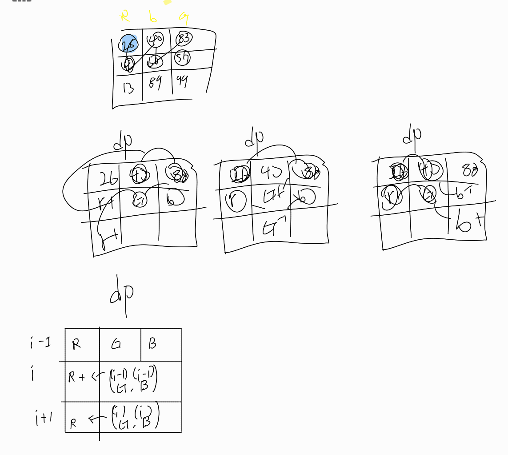

# 문제 링크

https://www.acmicpc.net/problem/1149

---

## 문제 설명

RGB거리에는 집이 N개 있다. 거리는 선분으로 나타낼 수 있고, 1번 집부터 N번 집이 순서대로 있다.

집은 빨강, 초록, 파랑 중 하나의 색으로 칠해야 한다. 각각의 집을 빨강, 초록, 파랑으로 칠하는 비용이 주어졌을 때, 아래 규칙을 만족하면서 모든 집을 칠하는 비용의 최솟값을 구해보자.

1번 집의 색은 2번 집의 색과 같지 않아야 한다.
N번 집의 색은 N-1번 집의 색과 같지 않아야 한다.
i(2 ≤ i ≤ N-1)번 집의 색은 i-1번, i+1번 집의 색과 같지 않아야 한다.

즉 현재의 위치를 기준으로 -1 , +1 과 겹치지 않게 색칠을 칠하며 해당 색칠을 하는데에 최소비용을 구하는 문제이다

---


## 문제 접근 과정

1. 완탐으로 풀기에는 최악의 경우 3^1000 이기때문에 다른 알고리즘으로 풀어야한다
2. DP를 활용한 문제이기 때문에 점화식을 도출하기 위해 노력했습니다.
---


## 시간복잡도

O(N + N) 의 시간만큼 걸렸습니다.

---

## 코드
```java

// 42분

package beakjoon.Dp;

import java.io.BufferedReader;
import java.io.IOException;
import java.io.InputStreamReader;
import java.util.StringTokenizer;

public class Boj1149_1 {
	public static void main(String[] args) throws IOException {
		BufferedReader br = new BufferedReader(new InputStreamReader(System.in));
		StringTokenizer st = new StringTokenizer(br.readLine());
		int N = Integer.parseInt(st.nextToken());
		int[][] arr = new int[N + 1][3];
		for (int i = 1; i <= N; i++) {
			st = new StringTokenizer(br.readLine());
			for (int j = 0; j < 3; j++) {
				arr[i][j] = Integer.parseInt(st.nextToken());
			}
		}
		int[][] dp = new int[N + 1][3];
		dp[1][0] = arr[1][0];
		dp[1][1] = arr[1][1];
		dp[1][2] = arr[1][2];
		for (int i = 2; i < arr.length; i++) {
			dp[i][0] = Math.min(dp[i - 1][1], dp[i - 1][2]) + arr[i][0];
			dp[i][1] = Math.min(dp[i - 1][0], dp[i - 1][2]) + arr[i][1];
			dp[i][2] = Math.min(dp[i - 1][1], dp[i - 1][0]) + arr[i][2];
		}
		System.out.println(Math.min(Math.min(dp[arr.length - 1][0], dp[arr.length - 1][1]), dp[arr.length - 1][2]));
	}
	/*
	집은 빨강, 초록, 파랑 중 하나의 색으로 칠해야 한다.
	각각의 집을 빨강, 초록, 파랑으로 칠하는 비용이 주어졌을 때,
	아래 규칙을 만족하면서 모든 집을 칠하는 비용의 최솟값을 구해보자.
	1번 집의 색은 2번 집의 색과 같지 않아야 한다.
	N번 집의 색은 N-1번 집의 색과 같지 않아야 한다.
	i(2 ≤ i ≤ N-1)번 집의 색은 i-1번, i+1번 집의 색과 같지 않아야 한다.
	 */
}
```


##  느낀점
- 점화식을 세우는데 시간이 오래 걸렸습니다

- 현재 알고리즘을 푸는 방식이 DP 인것으로 알고 풀었지만 실제로 코테에서 DP를 본다면 알고리즘을 분류하는데 시간이 걸릴거같습니다
