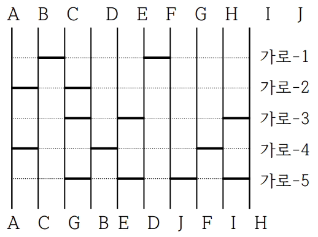

# 문제 링크

https://www.acmicpc.net/problem/2469

---

## 문제 설명

우리는 하나의 가로 줄이 감추어진 사다리를 받아서 그 줄의 각 칸에 가로 막대를 적절히 넣어서 참가자들의 최종 순서가 원하는 순서대로 나오도록 만들려고 한다.


---


## 문제 접근 과정

1. 물음표를 기준으로 탑다운 바텀업을 하여 해당 결과값들을 비교하여 문제를 풀었습니다
---


## 시간복잡도

시간복잡도는 O(N * K-1) 입니다. 

---

## 코드
```java
package beakjoon;

import java.io.BufferedReader;
import java.io.BufferedWriter;
import java.io.IOException;
import java.io.InputStreamReader;
import java.io.OutputStreamWriter;
import java.util.Objects;
import java.util.StringTokenizer;

public class Boj2469 {
	static int questionMarkIndex = 0;
	static char[] top;
	static char[] bottom;
	static char[] result;

	public static void main(String[] args) throws IOException {
		BufferedReader br = new BufferedReader(new InputStreamReader(System.in));

		StringTokenizer st = new StringTokenizer(br.readLine());
		int k = Integer.parseInt(st.nextToken()); // 참가한 사람의 수
		BufferedWriter bw = new BufferedWriter(new OutputStreamWriter(System.out));
		st = new StringTokenizer(br.readLine());
		int n = Integer.parseInt(st.nextToken()); // 가로 막대가 놓일 전체 가로줄의 수를 나타내는 n
		top = new char[k];
		bottom = new char[k];
		bottom = br.readLine().toCharArray();
		for (int i = 0; i < k; i++) {
			top[i] = (char)('A' + i);
		}

		Integer[][] row = new Integer[n][k - 1];

		for (int i = 0; i < n; i++) {
			st = new StringTokenizer(br.readLine());
			String elements = st.nextToken();
			for (int j = 0; j < k - 1; j++) {
				char tokens = elements.charAt(j);
				if (Objects.equals(tokens, '*')) {
					row[i][j] = 0;
				} else if (Objects.equals(tokens, '-')) {
					row[i][j] = 1;
				} else {
					questionMarkIndex = i;
					row[i][j] = -1;
				}
			}
		}
		bottomUp(row);
		topDown(row);
		result = new char[k - 1];
		for (int i = 0; i < k - 1; i++) {
			if (top[i] == bottom[i]) {
				bw.write('*');
			} else {
				char temp = top[i + 1];
				top[i + 1] = top[i];
				top[i] = temp;
				bw.write('-');
			}
		}
		for (int i = 0; i < k; i++) {
			if (top[i] != bottom[i]) {
				System.out.println("x".repeat(k - 1));
				return;
			}
		}
		bw.flush();
		bw.close();
	}

	private static void topDown(Integer[][] row) {
		for (int i = 0; i < questionMarkIndex; i++) {
			for (int j = 0; j < row[i].length; j++) {
				if (row[i][j] == 1) {
					char temp = top[j + 1];
					top[j + 1] = top[j];
					top[j] = temp;
				}
			}
		}
	}

	private static void bottomUp(Integer[][] row) {
		for (int i = row.length - 1; i > questionMarkIndex; i--) {
			for (int j = 0; j < row[i].length; j++) {
				if (row[i][j] == 1) {
					char temp = bottom[j + 1];
					bottom[j + 1] = bottom[j];
					bottom[j] = temp;
				}
			}
		}
	}
}
```

##  느낀점
- 처음의 문제를 어떻게 구현할지에 대해서 시간을 많이 사용하였지만 구현을 어떻게 할지 정한 이후에는 금방 만들었습니다
- 이렇게 문제를 풀어보니 구현을 어떻게 할지 빨리 도출하는게 좋은거 같습니다